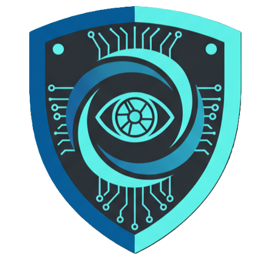

#  OccultaShield

**OccultaShield** es una plataforma avanzada de privacidad y procesamiento de video diseñada para garantizar el cumplimiento del **GDPR**. Utiliza inteligencia artificial para detectar y anonimizar automáticamente datos sensibles como rostros y matrículas en archivos de video.

Este proyecto representa una arquitectura **"Bleeding Edge"**, utilizando las tecnologías más modernas y eficientes del ecosistema web actual.

### 🦅 La Mascota: El Halcón Guardián


El **Halcón** simboliza la vigilancia, velocidad y precisión de nuestra plataforma. Al igual que un halcón detecta detalles desde las alturas, OccultaShield escanea cada fotograma de tus videos para localizar y proteger información sensible con exactitud milimétrica.

---

## 🚀 Stack Tecnológico

El proyecto está construido sobre un stack de alto rendimiento:

*   **Frontend:** [Angular v21](https://angular.io/) (Bleeding Edge / Nightly) con **Server-Side Rendering (SSR)**.
*   **Runtime & Server:** [Bun](https://bun.sh/) - Utilizado tanto para el tooling como para el servidor HTTP de producción (`Bun.serve`).
*   **Base de Datos:** [SurrealDB](https://surrealdb.com/) - Base de datos multi-modelo de alto rendimiento.
*   **Autenticación:** [Better-Auth](https://better-auth.com/) - Sistema de autenticación moderno y seguro.
*   **Lenguaje:** [TypeScript](https://www.typescriptlang.org/) - Tipado estricto en todo el stack.

---

## ✨ Características Principales

*   **🔒 Autenticación Robusta:** Registro y login seguro, gestión de sesiones y protección de rutas mediante Guards asíncronos.
*   **📂 Carga Inteligente:** Sistema de "Drag & Drop" global para la subida de archivos de video.
*   **🕵️ Análisis de Privacidad:** Detección automática de vulneraciones GDPR (Rostros, Matrículas).
*   **🛡️ Panel de Revisión:** Interfaz interactiva para revisar y aplicar modificaciones (difuminado, pixelado) a los elementos detectados.
*   **📊 Panel de Administración:**
    *   Dashboard con estadísticas en tiempo real (Usuarios, Sesiones, Archivos procesados).
    *   Gestión de usuarios y roles (Admin/User).
    *   Registro de actividad de subidas.
*   **⚡ Rendimiento Extremo:** Gracias a Bun y Angular SSR, la aplicación ofrece tiempos de carga y respuesta mínimos.

---

## 🛠️ Configuración y Ejecución

### Prerrequisitos

1.  **Bun**: [Instalar Bun](https://bun.sh/docs/installation).
2.  **SurrealDB**: [Instalar SurrealDB](https://surrealdb.com/install).

### 1. Instalación de Dependencias

```bash
bun install
```

### 2. Configuración de la Base de Datos

Inicia SurrealDB en tu entorno local (puerto 8000 por defecto):

```bash
surreal start --user root --pass root --bind 0.0.0.0:8000
```

Importa el esquema inicial (tablas de usuarios, sesiones y logs):

```bash
# Desde la raíz del proyecto
surreal import --conn http://localhost:8000 --user root --pass root --ns occultashield --db main server/schema.surql
```

### 3. Ejecución del Proyecto

#### Modo Desarrollo (Frontend Only)
Para trabajar en la interfaz (nota: las APIs del backend no funcionarán sin el servidor completo):
```bash
ng serve
```

#### Modo Full-Stack (SSR + API)
Para ejecutar la aplicación completa con el servidor Bun, autenticación y base de datos:
```bash
bun run start:ssr
```
*Esto compilará el proyecto y lanzará el servidor en `http://localhost:4000` (o el puerto configurado).*

---

## 👑 Gestión de Administradores

Por seguridad, no existen usuarios administradores por defecto. Para promover un usuario a **Admin**:

1.  Regístrate en la aplicación con un usuario normal.
2.  Accede a tu base de datos SurrealDB (vía CLI o Surrealist).
3.  Ejecuta la siguiente consulta:

```sql
UPDATE user SET role = 'admin' WHERE email = 'tu_email@ejemplo.com';
```

4.  Accede al panel de administración en `/admin`.

---

## 📂 Estructura del Proyecto

```
src/
├── app/
│   ├── components/      # Componentes reutilizables (ViolationCard, etc.)
│   ├── directives/      # Directivas globales (FileDrop)
│   ├── guards/          # Guardias de ruta (Auth, Role)
│   ├── pages/           # Vistas principales (Upload, Review, Admin...)
│   └── services/        # Lógica de negocio y comunicación API
├── server/              # Código del servidor Bun
│   ├── lib/             # Configuración de Auth y DB
│   └── schema.surql     # Esquema de base de datos
└── main.server.ts       # Punto de entrada SSR
```
