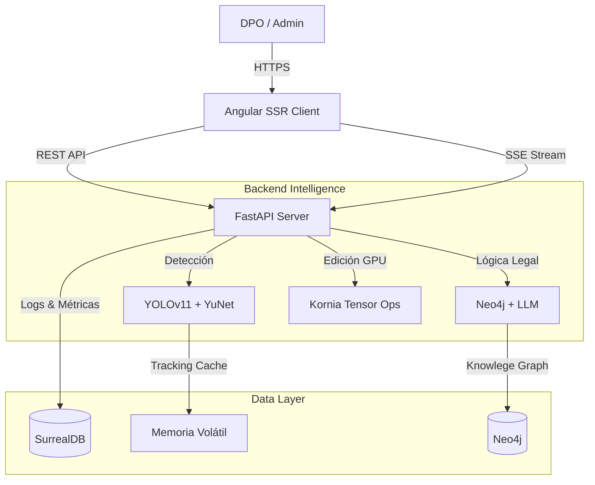

<div align="center">

# 🛡️ OccultaShield

### Plataforma Integral de Anonimización de Video & Cumplimiento RGPD

[](./LICENSE)
[]()
[](./backend)
[](./frontend)

*Protege la privacidad. Cumple la ley. Automatiza la burocracia.*

</div>

---

## 📖 Visión General del Proyecto

**OccultaShield** es una solución de seguridad y privacidad *end-to-end* diseñada para resolver el conflicto entre la videovigilancia y el Reglamento General de Protección de Datos (RGPD) de la UE. A diferencia de los sistemas tradicionales que aplican máscaras estáticas o difuminados indiscriminados, OccultaShield utiliza un **enfoque contextual**: entiende qué está pasando en la escena antes de decidir qué ocultar.

El sistema se compone de dos grandes monolitos orquestados:
1.  **Core de IA (Backend)**: Un motor de procesamiento asíncrono que combina visión por computador clásica (OpenCV), Deep Learning moderno (YOLOv11, YuNet) y Grafos de Conocimiento (Neo4j) para tomar decisiones legales en tiempo real.
2.  **Plataforma de Gestión (Frontend)**: Una interfaz web reactiva de última generación (Angular Zoneless) que permite a los responsables de datos (DPO) revisar, auditar y gestionar las solicitudes de acceso a video.

---

## 🏗️ Arquitectura del Sistema

La arquitectura sigue un patrón de **Microservicios Modulares** dentro de un monorepo, comunicados vía REST y SSE (Server-Sent Events) para feedback en tiempo real.



### Flujo de Datos Principal
1.  **Ingesta**: El video se sube y se pre-procesa (validación de códecs).
2.  **Detección Híbrida**: Se ejecutan modelos de segmentación (cuerpos) y detección facial especializada (YuNet) en paralelo.
3.  **Verificación Legal (GraphRAG)**: Cada detección se cruza con un grafo de conocimiento del RGPD. ¿Es un menor? ¿Es una figura pública? ¿Hay consentimiento implícito?
4.  **Renderizado Tensorial**: Las máscaras de privacidad se generan y aplican directamente en la VRAM de la GPU usando Kornia, garantizando reversibilidad cero.

---

## 🚀 Componentes del Repositorio

### 📂 [Backend (Motor de IA)](./backend)
El cerebro del sistema.
*   **Gestión de Paquetes**: `uv` (reemplazo moderno de pip).
*   **IA de Visión**: YOLOv11-seg para siluetas, Kornia FaceDetector (YuNet 640/320) para rostros.
*   **Base de Datos**: SurrealDB (Multimodal) para logs de auditoría y metadatos de video.

### 📂 [Frontend (Dashboard)](./frontend)
La cara visible para el usuario.
*   **Runtime**: Bun (Performance extremo en desarrollo y SSR).
*   **Framework**: Angular v21 con arquitectura **Zoneless** (Signals puros).
*   **Seguridad**: Better-Auth para autenticación robusta y marcas de agua dinámicas.

---

## ⚡ Inicio Rápido (Quick Start)

### Prerrequisitos Globales
*   [Docker](https://www.docker.com/) (Recomendado para DBs)
*   [Bun](https://bun.sh) v1.1+
*   [uv](https://github.com/astral-sh/uv)
*   Drivers NVIDIA (Opcional, pero recomendado para producción)

### 1. Infraestructura de Datos
Levanta las bases de datos necesarias:
```bash
# SurrealDB en memoria (puerto 8000)
surreal start --user root --pass root memory --bind 0.0.0.0:8000

# Neo4j (puerto 7474/7687)
docker run -p 7474:7474 -p 7687:7687 -e NEO4J_AUTH=neo4j/password -e NEO4J_PLUGINS='["apoc", "graph-data-science"]' neo4j:latest
```

### 2. Ejecutar OccultaShield
Sigue las instrucciones detalladas en `backend/README.md` y `frontend/README.md` para iniciar cada servicio.

---

## 🔒 Seguridad y Compliance
Este proyecto ha sido diseñado siguiendo los principios de **Privacy by Design**:
*   **Minimización de Datos**: Solo se procesan los frames necesarios.
*   **Auditoría Inmutable**: Todas las acciones de los administradores quedan registradas en SurrealDB.
*   **Soberanía del Dato**: Todo el procesamiento es local u *on-premise*, sin envío de videos a nubes de terceros.

---

## 🤝 Contribución
Proyecto privado. Contactar con el equipo de desarrollo para acceso a ramas experimentales (`feature/*`).
