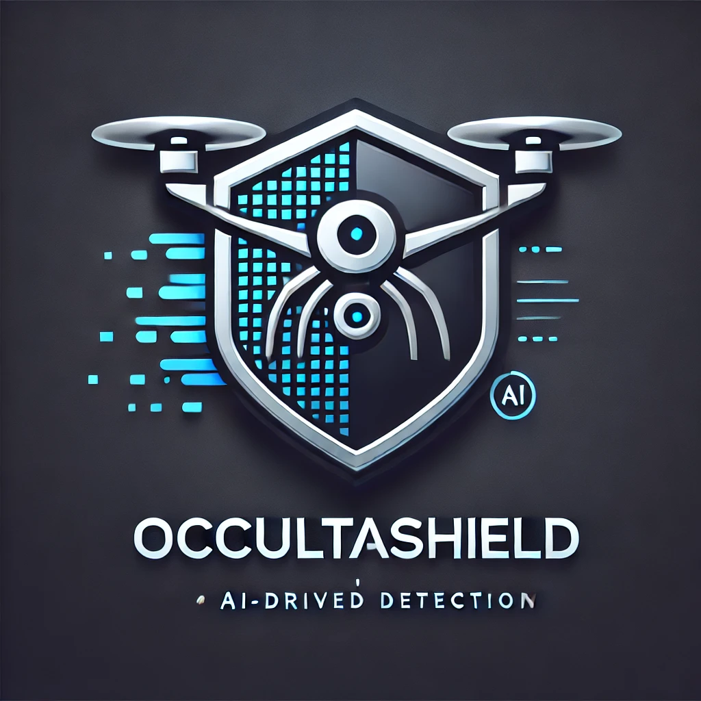
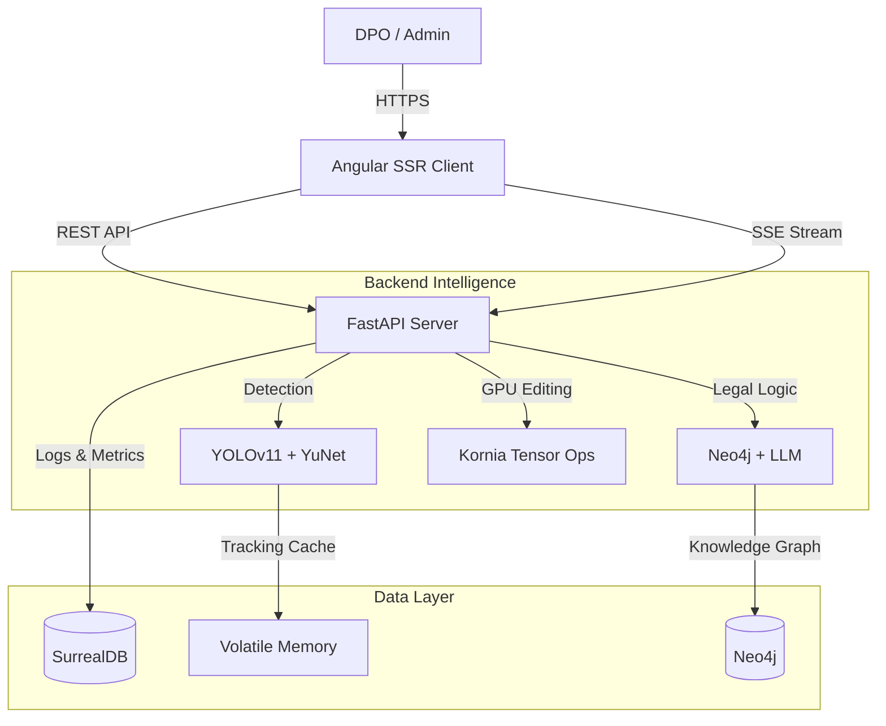

<div align="center">
  
  <h1>OccultaShield</h1>
  
  <p>
    <strong>GDPR & AI Act Compliance Tool for Video Anonymization</strong>
  </p>

  <a href="./LICENSE.md">
    
  </a>
  <a href="./TERMS.md">
    
  </a>
  <a href="#">
    
  </a>
</div>

---

### ⚠️ IMPORTANT LEGAL NOTICE

**This software is NOT "Open Source" under standard OSI definitions.**

**OccultaShield** is released under the **[OccultaShield Source-Available License](./LICENSE.md)**.
* ✅ **Permitted:** Personal use, educational use, non-profit research, and internal testing.
* ❌ **Prohibited:** Any commercial use, SaaS deployment, or business integration without a commercial license.
* ⚖️ **Responsibility:** The user acts as the **"Deployer"** under the **EU AI Act**. You assume full liability for compliance with local laws (GDPR, LOPD-GDD, etc.).

**[Read the Full Terms of Service & Acceptable Use Policy](./TERMS.md)** before proceeding.

---

## 📖 About the Project

**OccultaShield** is an *end-to-end* security and privacy solution designed to resolve the conflict between video surveillance and the EU's General Data Protection Regulation (GDPR). Unlike traditional systems that apply static masks or indiscriminate blurring, OccultaShield uses a **contextual approach**: it understands what is happening in the scene before deciding what to hide.

The system consists of two main orchestrated monoliths:
1.  **AI Core (Backend)**: An asynchronous processing engine that combines classical computer vision (OpenCV), modern Deep Learning (YOLOv11, YuNet), and Knowledge Graphs (Neo4j) to make legal decisions in real-time.
2.  **Management Platform (Frontend)**: A cutting-edge reactive web interface (Angular Zoneless) that allows Data Protection Officers (DPOs) to review, audit, and manage video access requests.

To see OccultaShield in action, watch our project demonstration video: [OccultaShield: Motor de Anonimización de Video GDPR con IA (On-Premise & GraphRAG) | Demo Técnica](https://youtu.be/l_T2g_cFirU)

---

## 🏗️ System Architecture

The architecture follows a **Modular Microservices** pattern within a monorepo, communicating via REST and SSE (Server-Sent Events) for real-time feedback.



### Main Data Flow
1.  **Ingestion**: The video is uploaded and pre-processed (codec validation).
2.  **Hybrid Detection**: Segmentation models (bodies) and specialized facial detection (YuNet) run in parallel.
3.  **Legal Verification (GraphRAG)**: Each detection is cross-referenced with a GDPR knowledge graph. Is it a minor? Is it a public figure? Is there implicit consent?
4.  **Tensor Rendering**: Privacy masks are generated and applied directly to the GPU VRAM using Kornia, ensuring zero reversibility.

---

## 🚀 Repository Components

### 📂 [Backend (AI Engine)](./backend)
The brain of the system.
*   **Package Management**: `uv` (modern pip replacement).
*   **Vision AI**: YOLOv11-seg for silhouettes, Kornia FaceDetector (YuNet 640/320) for faces.
*   **Database**: SurrealDB (Multimodal) for audit logs and video metadata.

### 📂 [Frontend (Dashboard)](./frontend)
The user-facing interface.
*   **Runtime**: Bun (Extreme performance in development and SSR).
*   **Framework**: Angular v21 with **Zoneless** architecture (pure Signals).
*   **Security**: Better-Auth for robust authentication and dynamic watermarks.

---

## ⚡ Quick Start

### Global Prerequisites
*   [Docker](https://www.docker.com/) (Recommended for DBs)
*   [Bun](https://bun.sh) v1.3+
*   [uv](https://github.com/astral-sh/uv)
*   NVIDIA Drivers (Optional, but recommended for production)

### 1. Data Infrastructure
Start the required databases:
```bash
# SurrealDB in memory (port 8000)
surreal start --user root --pass root memory --bind 0.0.0.0:8000

# Neo4j (port 7474/7687)
docker run -p 7474:7474 -p 7687:7687 -e NEO4J_AUTH=neo4j/password -e NEO4J_PLUGINS='["apoc", "graph-data-science"]' neo4j:latest
```

### 2. Run OccultaShield
Follow the detailed instructions in `backend/README.md` and `frontend/README.md` to start each service.

---

## 🔒 Security and Compliance
This project has been designed following **Privacy by Design** principles:
*   **Data Minimization**: Only necessary frames are processed.
*   **Immutable Audit**: All administrator actions are recorded in SurrealDB.
*   **Data Sovereignty**: All processing is local or *on-premise*, with no video transmission to third-party clouds.

---

## 🤝 Contributing
Private project. Contact the development team for access to experimental branches (`feature/*`).
