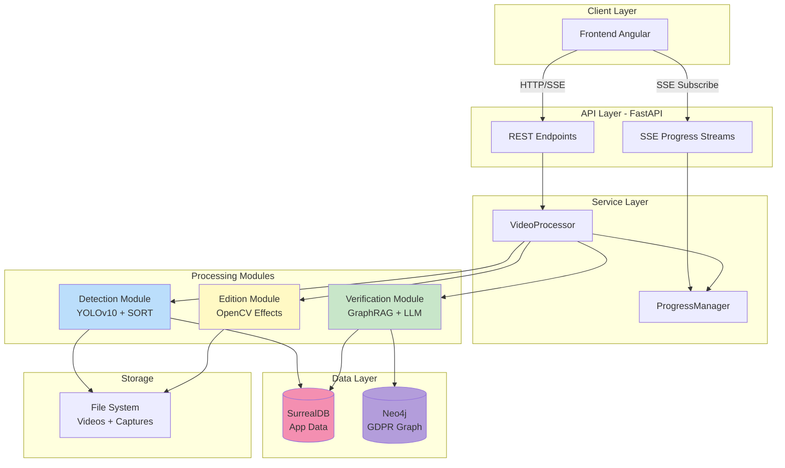
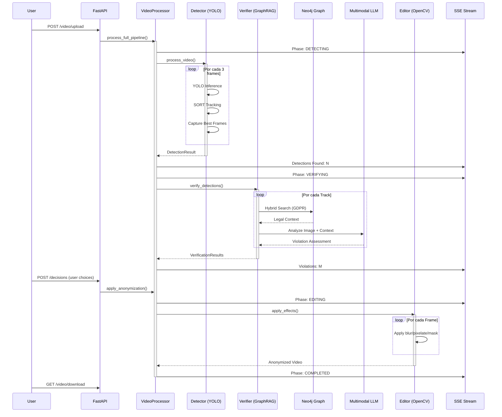

<div align="center">

# OccultaShield Backend

### Sistema Inteligente de Verificación GDPR y Anonimización de Videos

[](https://fastapi.tiangolo.com/)
[](https://www.python.org/)
[](https://pytorch.org/)
[](https://surrealdb.com/)
[](https://neo4j.com/)
[](https://langchain-ai.github.io/langgraph/)

**Motor de privacidad impulsado por IA que combina Computer Vision, Grafos de Conocimiento Legal y LLMs Multimodales para análisis GDPR automatizado.**

[📖 Documentación Detallada](README_BACKEND_DETAILED.md) • [🎯 Casos de Uso](#-casos-de-uso) • [🚀 Inicio Rápido](#-inicio-rápido)

</div>

---

## Tabla de Contenidos

- [Visión General](#-visión-general)
- [Arquitectura del Sistema](#-arquitectura-del-sistema)
- [Tecnologías Principales](#-tecnologías-principales)
- [Pipeline de Procesamiento](#-pipeline-de-procesamiento)
- [Características Destacadas](#-características-destacadas)
- [Inicio Rápido](#-inicio-rápido)
- [Configuración](#-configuración)
- [Estructura del Proyecto](#-estructura-del-proyecto)
- [API Endpoints](#-api-endpoints)
- [Casos de Uso](#-casos-de-uso)
- [Requisitos del Sistema](#-requisitos-del-sistema)

---

## Visión General

**OccultaShield Backend** es un sistema de análisis de privacidad de videos que automatiza la detección, verificación legal y anonimización de datos personales según el Reglamento General de Protección de Datos (GDPR).

### ¿Qué hace diferente a OccultaShield?

En lugar de aplicar censura indiscriminada, OccultaShield **analiza el contexto legal** de cada detección usando un grafo de conocimiento del GDPR completo y modelos de lenguaje multimodales. El sistema:

1. **Detecta** elementos sensibles usando YOLOv10 (rostros, matrículas, personas)
2. **Rastrea** objetos a través del tiempo con algoritmo SORT
3. **Verifica** legalmente cada detección consultando un grafo Neo4j con 99 artículos del GDPR
4. **Analiza** imágenes con LLMs multimodales que "ven" el contexto visual
5. **Recomienda** acciones específicas (blur, pixelate, mask) basadas en severidad
6. **Anonimiza** automáticamente aplicando efectos adaptativos

### Estadísticas del Proyecto

- **~2,500 líneas** de código Python
- **15 tablas** en SurrealDB (autenticación + dominio)
- **10 tipos de nodos** en Neo4j (grafo legal)
- **149 embeddings vectoriales** (artículos GDPR + conceptos legales)
- **8 endpoints REST** + 3 endpoints SSE
- **3 fases de procesamiento** (Detection → Verification → Edition)

---

## Arquitectura del Sistema

### Diagrama de Alto Nivel



### Pipeline Completo de Procesamiento



---

## Tecnologías Principales

### Stack Core

| Categoría | Tecnología | Propósito |
|-----------|-----------|-----------|
| **Framework Web** | FastAPI 0.124.0+ | API REST asíncrona de alto rendimiento |
| **Servidor ASGI** | Uvicorn 0.38.0+ | Servidor de aplicaciones async |
| **Validación** | Pydantic 2.12.0+ | Modelos de datos type-safe |

### AI/ML Stack

| Tecnología | Versión | Uso |
|-----------|---------|-----|
| **PyTorch** | 2.6.0+ | Framework de deep learning |
| **Ultralytics** | 8.3.0+ | YOLOv10 para detección de objetos |
| **Transformers** | 4.47.0+ | Hugging Face (Gemma/Llama LLMs) |
| **Sentence-Transformers** | 5.1.0+ | Embeddings semánticos para RAG |
| **OpenCV** | 4.12.0+ | Procesamiento de video y anonimización |

### LangChain Ecosystem

| Componente | Versión | Funcionalidad |
|-----------|---------|---------------|
| **LangChain** | 0.3.0+ | Cadenas y workflows LLM |
| **LangGraph** | 0.4.0+ | Workflows basados en grafos de estado |
| **LangChain-Neo4j** | 0.6.0+ | Integración GraphRAG |

### Bases de Datos

| Base de Datos | Propósito | Esquema |
|--------------|-----------|---------|
| **SurrealDB 1.0+** | Datos de aplicación | 15 tablas (users, videos, detections, verifications) |
| **Neo4j 5.x** | Grafo de conocimiento GDPR | 99 artículos, 50+ conceptos, embeddings vectoriales |

---

## Pipeline de Procesamiento

### Fase 1: Detección (Detection Module)

```python
# modules/detection/detector.py
```

**Componentes:**
- **VideoDetector**: Procesa video frame por frame con YOLOv10
- **ObjectTracker**: Algoritmo SORT para tracking multi-objeto
- **CaptureManager**: Captura inteligente de mejores frames

**Flujo de Trabajo:**

1. **Inicialización**: Carga modelo YOLOv10s (640px, confidence 0.5)
2. **Procesamiento por Frame**:
   - Lee frame cada 3 frames (configurable)
   - Ejecuta inferencia YOLO
   - Actualiza tracker SORT (asigna TrackIDs únicos)
   - Evalúa estabilidad (confidence + stabilidad de bbox)
3. **Captura Selectiva**:
   - Solo captura frames estables (3+ frames consecutivos)
   - Máximo 8 capturas por track
   - Intervalo mínimo 1.5s entre capturas
4. **Persistencia**:
   - Guarda detecciones en tabla `detection` (SurrealDB)
   - Almacena capturas en `storage/captures/{video_id}/track_{id}/`

**Salida Ejemplo:**
```json
{
  "track_id": 1,
  "detection_type": "person",
  "first_frame": 45,
  "last_frame": 892,
  "duration_seconds": 28.3,
  "avg_confidence": 0.87,
  "captures": [
    {
      "frame": 120,
      "image_path": "storage/captures/vid123/track_1/frame_120.jpg",
      "bbox": {"x1": 340, "y1": 120, "x2": 580, "y2": 650},
      "reason": "high_stability"
    }
  ]
}
```

**Optimizaciones:**
- **Reducción de Llamadas LLM**: Sin tracking, 300 detecciones del mismo objeto = 300 verificaciones. Con tracking: 1 verificación por aparición (~95% reducción).
- **Selección Inteligente**: Solo verifica mejores frames (alta confianza + bbox estable).

---

### Fase 2: Verificación (Verification Module - GraphRAG)

```python
# modules/verification/graph_rag.py
```

**Arquitectura GraphRAG:**

```
┌─────────────────────────────────────────────────────────┐
│           GDPRVerificationGraph (Singleton)             │
├─────────────────────────────────────────────────────────┤
│  Components:                                            │
│  • GraphDB (Neo4j Híbrido)                             │
│  • GemmaClient (Multimodal LLM)                        │
│  • LangGraph Workflow                                  │
└─────────────────────────────────────────────────────────┘
         │                      │
         v                      v
┌──────────────────┐   ┌────────────────────┐
│  Retrieve Node   │   │   Verify Node      │
├──────────────────┤   ├────────────────────┤
│ 1. Vector Search │   │ 1. Load Image      │
│ 2. Cypher Query  │   │ 2. Build Prompt    │
│ 3. Merge Results │   │ 3. LLM Inference   │
└──────────────────┘   │ 4. Parse JSON      │
         │              └────────────────────┘
         └────────┬────────────┘
                  v
          ┌──────────────┐
          │   END Node   │
          └──────────────┘
```

**Búsqueda Híbrida Neo4j:**

```cypher
# 1. Vector Search (Semántica)
CALL db.index.vector.queryNodes(
  'gdpr_vector_index',
  5,  -- top_k
  embedding  -- del query "face detection"
)

# 2. Cypher Keyword Search (Estructurada)
MATCH (a:Article)
WHERE any(kw IN $keywords WHERE a.keywords CONTAINS kw)
  OR any(kw IN $keywords WHERE a.full_text CONTAINS kw)
RETURN a

# 3. Deduplicación + Ranking por Relevancia
```

**Mapeo de Keywords:**
```python
{
    "face": ["biometric", "facial", "special categories", "consent"],
    "person": ["personal data", "data subject", "processing"],
    "license_plate": ["vehicle", "identification", "personal data"]
}
```

**Prompt Template (LLM):**
```python
"""
You are an expert GDPR Compliance Analyst AI.

## DETECTED ELEMENTS
- Type: face
- Location: 340x120 to 580x650

## RELEVANT GDPR ARTICLES
Article 9 - Processing of special categories of personal data
1. Processing of personal data revealing racial or ethnic origin,
   political opinions, religious or philosophical beliefs, or trade
   union membership, and the processing of genetic data, biometric
   data for the purpose of uniquely identifying a natural person...

[... more context ...]

## TASK
Analyze the provided image and determine if exposing the detected
elements constitutes a GDPR violation.

## OUTPUT FORMAT (JSON)
{
  "is_violation": bool,
  "severity": "Critical|High|Medium|Low|None",
  "violated_articles": ["Article 9", "Article 6"],
  "detected_personal_data": ["biometric_data", "facial_features"],
  "description": "The image clearly shows an identifiable face...",
  "recommended_action": "blur|pixelate|mask|no_action",
  "confidence": 0.95
}
"""
```

**Salida Ejemplo:**
```json
{
  "is_violation": true,
  "severity": "High",
  "violated_articles": ["Article 9(1)", "Article 6(1)"],
  "detected_personal_data": ["biometric_data", "facial_features"],
  "description": "La imagen contiene un rostro claramente identificable con alta resolución. Según el Artículo 9, los datos biométricos son categoría especial y requieren consentimiento explícito o base legal específica.",
  "recommended_action": "blur",
  "confidence": 0.92,
  "_metadata": {
    "model_used": "google/gemma-3-4b-it",
    "legal_context_articles": 5,
    "processing_time_ms": 2340
  }
}
```

**Innovaciones Clave:**
- **Multimodalidad**: El LLM "ve" la imagen + lee contexto legal simultáneamente
- **Determinismo**: `do_sample=False` para respuestas consistentes
- **Trazabilidad**: Cada decisión cita artículos GDPR específicos
- **Explicabilidad**: Razonamiento en lenguaje natural

---

### Fase 3: Edición (Edition Module)

```python
# modules/edition/video_editor.py
```

**Efectos de Anonimización:**

| Efecto | Implementación | Uso Recomendado |
|--------|---------------|-----------------|
| **Blur Gaussiano** | `cv2.GaussianBlur()` con kernel adaptativo | Rostros, matrículas (preserva contexto) |
| **Pixelate** | Resize down → Resize up `INTER_NEAREST` | Documentos, textos sensibles |
| **Mask** | `cv2.rectangle()` color negro | Información crítica (full occlusion) |

**Algoritmo:**
```python
def apply_anonymization(input_path, output_path, actions):
    """
    actions = [
        {
            "type": "blur",
            "bboxes": {
                120: [340, 120, 580, 650],  # frame: [x1, y1, x2, y2]
                121: [342, 122, 582, 652],
                ...
            }
        }
    ]
    """
    cap = cv2.VideoCapture(input_path)
    out = cv2.VideoWriter(output_path, fourcc, fps, (width, height))

    frame_idx = 0
    while True:
        ret, frame = cap.read()
        if not ret: break

        # Aplicar todos los efectos para este frame
        for action in actions:
            if frame_idx in action["bboxes"]:
                bbox = action["bboxes"][frame_idx]
                frame = apply_effect(frame, bbox, action["type"])

        out.write(frame)
        frame_idx += 1
```

**Blur Adaptativo:**
```python
def apply_blur(frame, bbox):
    x1, y1, x2, y2 = bbox
    roi = frame[y1:y2, x1:x2]

    # Kernel size proporcional al tamaño del objeto
    ksize = max(int((x2-x1) / 3) | 1, 11)  # Impar, mínimo 11
    blurred = cv2.GaussianBlur(roi, (ksize, ksize), 0)

    frame[y1:y2, x1:x2] = blurred
    return frame
```

**Características:**
- **Interpolación de Bboxes**: Suaviza transiciones entre frames
- **Preservación de Audio**: `preserve_audio=true`
- **Procesamiento Asíncrono**: Yields cada 20 frames para progress tracking

---

## Características Destacadas

### 1. Server-Sent Events (SSE) para Progreso en Tiempo Real

```python
# api/v1/progress.py
@router.get("/process/{video_id}/progress")
async def stream_progress(video_id: str):
    async def event_generator():
        queue = await progress_manager.subscribe(video_id)

        try:
            while True:
                event = await queue.get()

                if event.event_type == "complete":
                    yield event.to_sse()
                    break
                elif event.event_type == "error":
                    yield event.to_sse()
                    break
                else:
                    yield event.to_sse()

        except asyncio.CancelledError:
            await progress_manager.unsubscribe(video_id, queue)

    return EventSourceResponse(event_generator())
```

**Tipos de Eventos:**
- `phase_change`: Cambio de fase (detecting → verifying → editing)
- `progress`: Actualización de % completado
- `detection`: Nueva detección encontrada
- `verification`: Resultado de verificación GDPR
- `complete`: Procesamiento terminado
- `error`: Error ocurrido
- `heartbeat`: Keep-alive cada 15s

**Ventajas:**
- UX superior: Usuario ve progreso en vivo
- Reconexión automática en caso de desconexión
- Efficient: Unidireccional (server → client)

---

### 2. Dual Database Architecture

```
┌─────────────────────────────────────────────────────┐
│                   SurrealDB                         │
│  ┌──────────┬──────────┬──────────┬──────────────┐ │
│  │  users   │ sessions │  videos  │  detections  │ │
│  ├──────────┼──────────┼──────────┼──────────────┤ │
│  │ accounts │ verific. │decisions │  metadata... │ │
│  └──────────┴──────────┴──────────┴──────────────┘ │
│                                                     │
│  PROPÓSITO: Operational Data (CRUD, Auth, State)   │
└─────────────────────────────────────────────────────┘

┌─────────────────────────────────────────────────────┐
│                      Neo4j                          │
│  ┌──────────────────────────────────────────────┐  │
│  │  (Article)-[:DEFINES]->(Concept)             │  │
│  │  (Article)-[:GRANTS]->(Right)                │  │
│  │  (Fine)-[:APPLIES_TO]->(Article)             │  │
│  │  (DetectionType)-[:VIOLATES]->(Article)      │  │
│  └──────────────────────────────────────────────┘  │
│                                                     │
│  PROPÓSITO: Knowledge Graph (RAG, Legal Context)   │
│  • 99 Articles • 149 Embeddings • Hybrid Search    │
└─────────────────────────────────────────────────────┘
```

**¿Por qué dos bases de datos?**
- **SurrealDB**: Excelente para datos operacionales, auth, y NoSQL flexible
- **Neo4j**: Especializado en grafos, búsqueda vectorial, y queries complejas

---

### 3. Sistema de Configuración YAML con Variables de Entorno

```yaml
# config/detection.yaml
detector:
  model_path: "${YOLO_MODEL_PATH:ml_models/yolo/yolov10s.pt}"
  #           ^^^^^^^^^^^^^^^^^ Variable de entorno
  #                            ^^^^^^^^^^^^^^^^^^^^^^^ Default si no existe
  confidence_threshold: 0.5

tracking:
  max_age: 30
  min_hits: 3

verification:
  llm_model: "${MULTIMODAL_MODEL_ID:google/gemma-3-4b-it}"
  parallel_workers: 2
```

**Ventajas:**
- Mismo código funciona en dev/staging/prod
- Secrets en `.env`, configuración técnica en YAML
- Fácil ajuste de parámetros sin tocar código

---

### 4. Singleton Pattern para Modelos Pesados

```python
class GDPRVerificationGraph:
    _instance = None
    _model_loaded = False

    def __new__(cls):
        if cls._instance is None:
            cls._instance = super().__new__(cls)
        return cls._instance

    def __init__(self):
        if not self._model_loaded:
            self._load_models()  # 30s, 8GB VRAM
            GDPRVerificationGraph._model_loaded = True
```

**Resultado:**
- Primera request: ~30s (carga modelo)
- Requests subsecuentes: ~2-5s (solo inferencia)
- Memoria eficiente: 1 modelo en RAM/VRAM

---

### 5. Autenticación Better-Auth Compatible

```sql
-- SurrealDB Schema compatible con Better-Auth
TABLE user {
  email: string UNIQUE,
  emailVerified: bool,
  role: string DEFAULT "user",
  createdAt: datetime
}

TABLE session {
  userId: record<user>,
  token: string UNIQUE,
  expiresAt: datetime
}

TABLE account {
  userId: record<user>,
  providerId: string,  -- "google", "github"
  accessToken: option<string>
}
```

**Soporte:**
- OAuth2 (Google, GitHub, etc.)
- Email/Password con hash bcrypt
- JWT tokens
- Session management
- 2FA ready

---

## Inicio Rápido

### Prerrequisitos

- **Python**: 3.11+ (recomendado Anaconda)
- **GPU**: NVIDIA con 8GB+ VRAM (recomendado para LLM)
- **Docker**: Para bases de datos (opcional pero recomendado)
- **Espacio**: ~15GB para modelos + bases de datos

### 1. Clonar e Instalar

```bash
# Clonar repositorio
git clone https://github.com/tu-usuario/OccultaShield.git
cd OccultaShield/backend

# Crear entorno virtual
conda create -n occultashield python=3.11
conda activate occultashield

# Instalar dependencias
pip install -r requirements.txt
```

### 2. Configurar Variables de Entorno

```bash
# Copiar plantilla
cp .env.example .env

# Editar .env con tus credenciales
nano .env
```

```bash
# .env
# Server
SERVER_HOST=0.0.0.0
SERVER_PORT=8900

# SurrealDB
SURREALDB_HOST=localhost
SURREALDB_PORT=8000
SURREALDB_USER=root
SURREALDB_PASS=root
SURREALDB_NAMESPACE=occultashield
SURREALDB_DATABASE=main

# Neo4j
NEO4J_URI=bolt://localhost:7687
NEO4J_USER=neo4j
NEO4J_PASSWORD=your_secure_password

# AI Models
YOLO_MODEL_PATH=ml_models/yolo/yolov10s.pt
MULTIMODAL_MODEL_ID=google/gemma-3-4b-it
EMBEDDING_MODEL=all-MiniLM-L6-v2

# Hugging Face (opcional, para modelos privados)
HUGGINGFACE_TOKEN=hf_xxxxxxxxxxxxx

# Storage
STORAGE_PATH=./storage
```

### 3. Levantar Bases de Datos

#### Opción A: Docker Compose (Recomendado)

```yaml
# docker-compose.yml
version: '3.8'
services:
  surrealdb:
    image: surrealdb/surrealdb:latest
    ports:
      - "8000:8000"
    command: start --user root --pass root
    volumes:
      - surreal_data:/data

  neo4j:
    image: neo4j:5.15
    ports:
      - "7474:7474"  # Browser
      - "7687:7687"  # Bolt
    environment:
      NEO4J_AUTH: neo4j/your_secure_password
      NEO4J_PLUGINS: '["apoc"]'
    volumes:
      - neo4j_data:/data

volumes:
  surreal_data:
  neo4j_data:
```

```bash
docker-compose up -d
```

#### Opción B: Manual

```bash
# SurrealDB
docker run -d -p 8000:8000 \
  -v surreal_data:/data \
  surrealdb/surrealdb:latest start \
  --user root --pass root

# Neo4j
docker run -d -p 7474:7474 -p 7687:7687 \
  -v neo4j_data:/data \
  -e NEO4J_AUTH=neo4j/your_secure_password \
  neo4j:5.15
```

### 4. Inicializar Esquemas

```bash
cd app

# Crear tablas en SurrealDB
python -m db.init_schemas

# Ingerir GDPR en Neo4j
python -m scripts.gdpr_ingestion.ingest_gdpr
```

### 5. Descargar Modelos

```bash
# YOLOv10 (auto-descarga al primer uso)
mkdir -p ml_models/yolo

# Para pre-descargar:
python -c "from ultralytics import YOLO; YOLO('yolov10s.pt')"
mv yolov10s.pt ml_models/yolo/

# Gemma/Llama se descarga automáticamente de Hugging Face
# Asegúrate de tener HUGGINGFACE_TOKEN si el modelo es privado
```

### 6. Iniciar el Servidor

```bash
# Desde backend/app
python main.py

# O con Uvicorn directamente
uvicorn main:app --host 0.0.0.0 --port 8900 --reload
```

**Salida esperada:**
```
INFO:     Started server process [12345]
INFO:     Waiting for application startup.
INFO:     Application startup complete.
INFO:     Uvicorn running on http://0.0.0.0:8900 (Press CTRL+C to quit)
```

### 7. Verificar Instalación

```bash
# Health check
curl http://localhost:8900/health

# Respuesta esperada:
# {"status": "healthy", "database": "connected"}

# Ver documentación API
open http://localhost:8900/docs  # Swagger UI
```

---

## Configuración

### Archivo de Configuración Principal

El sistema usa `config/detection.yaml` para parámetros de procesamiento:

```yaml
detector:
  model_path: "${YOLO_MODEL_PATH:ml_models/yolo/yolov10s.pt}"
  confidence_threshold: 0.5      # Confianza mínima para detecciones
  iou_threshold: 0.45             # Non-max suppression
  device: "auto"                  # "cuda", "cpu", o "auto"
  image_size: 640                 # Tamaño de entrada YOLO
  target_classes: [0]             # 0 = person (COCO)

tracking:
  iou_threshold: 0.3              # Overlap para matching tracks
  max_age: 30                     # Frames antes de eliminar track
  min_hits: 3                     # Hits para confirmar track
  min_duration: 0.5               # Segundos mínimos para track válido

processing:
  detection_interval: 3           # Detectar cada N frames
  capture_interval: 1.5           # Capturar cada N segundos
  max_captures: 8                 # Máximo capturas por track
  stability_threshold: 0.5        # Confianza mínima para captura
  stability_frames: 3             # Frames estables requeridos
  max_processing_time: 3600       # Timeout en segundos (1 hora)

storage:
  base_path: "${STORAGE_PATH:./storage}"
  image_quality: 95               # Calidad JPEG (1-100)
  crop_margin: 20                 # Píxeles extra al recortar
  create_thumbnails: true
  thumbnail_size: [128, 128]
  retention_days: 30              # Auto-limpieza de archivos antiguos

edition:
  blur:
    kernel_size: 99               # Tamaño máximo del blur gaussiano
  pixelate:
    pixel_size: 10                # Tamaño del pixel
  mask:
    color: [0, 0, 0]              # Color del mask (negro)
  preserve_audio: true
  output_codec: "mp4v"
  interpolate_bboxes: true        # Suavizar transiciones

verification:
  enabled: true
  llm_model: "${MULTIMODAL_MODEL_ID:google/gemma-3-4b-it}"
  timeout: 30                     # Timeout por imagen (segundos)
  max_retries: 2
  parallel_workers: 2             # Agentes concurrentes
  use_best_capture: true          # Verificar solo mejor capture
```

### Optimización de Rendimiento

#### GPU vs CPU

```python
# detection.yaml
detector:
  device: "cuda"      # GPU (recomendado): ~30 FPS
  # device: "cpu"     # CPU: ~5 FPS
```

#### Reducir Uso de VRAM

```yaml
# Usar modelo más pequeño
detector:
  model_path: "yolov10n.pt"  # Nano: 2.5MB, 1.8GB VRAM
  # yolov10s.pt              # Small: 7.2MB, 4.2GB VRAM
  # yolov10m.pt              # Medium: 15.4MB, 8.3GB VRAM

verification:
  llm_model: "google/gemma-2b-it"  # 2B parámetros, 4GB VRAM
  # gemma-3-4b-it                  # 4B parámetros, 8GB VRAM
  # Meta-Llama-3-8B                # 8B parámetros, 16GB VRAM
```

#### Aumentar Velocidad de Procesamiento

```yaml
processing:
  detection_interval: 5      # Detectar cada 5 frames (más rápido)
  max_captures: 4            # Menos capturas por track

verification:
  parallel_workers: 4        # Más agentes concurrentes (requiere más VRAM)
  use_best_capture: true     # Verificar solo 1 captura por track
```

---

## Estructura del Proyecto

```
backend/
├── app/
│   ├── api/
│   │   └── v1/
│   │       ├── endpoints/
│   │       │   └── video.py          # CRUD de videos
│   │       ├── progress.py           # SSE endpoints
│   │       └── router.py             # Router principal API
│   │
│   ├── auth/
│   │   └── auth_middleware.py        # JWT authentication
│   │
│   ├── config/
│   │   ├── config_loader.py          # Cargador YAML + env vars
│   │   └── detection.yaml            # Configuración principal
│   │
│   ├── core/
│   │   ├── dependencies.py           # Dependency injection
│   │   └── events.py                 # Modelos de eventos SSE
│   │
│   ├── db/
│   │   ├── surreal_conn.py           # Cliente async SurrealDB
│   │   ├── neo4j_queries.py          # Queries Cypher predefinidas
│   │   ├── init_schemas.py           # Inicializador de schemas
│   │   └── schemas.surql             # Definición tablas SurrealDB
│   │
│   ├── models/
│   │   └── video.py                  # Modelos Pydantic (235 líneas)
│   │
│   ├── modules/
│   │   ├── detection/                # FASE 1: Detección
│   │   │   ├── detector.py           # VideoDetector (YOLO)
│   │   │   ├── tracker.py            # ObjectTracker (SORT)
│   │   │   ├── capture_manager.py    # Gestión de capturas
│   │   │   └── models.py             # Estructuras de datos
│   │   │
│   │   ├── verification/             # FASE 2: Verificación GDPR
│   │   │   ├── graph_rag.py          # Sistema GraphRAG (323 líneas)
│   │   │   ├── graph_db.py           # Cliente Neo4j híbrido
│   │   │   ├── graph_client.py       # Cliente async Neo4j
│   │   │   ├── gemma_client.py       # Cliente LLM multimodal
│   │   │   ├── sub_agent.py          # Agente individual
│   │   │   ├── consensus_agent.py    # Agregador multi-agente
│   │   │   ├── parallel_processor.py # Orquestador paralelo
│   │   │   └── ingest_gdpr.py        # Ingesta GDPR a Neo4j
│   │   │
│   │   └── edition/                  # FASE 3: Edición
│   │       └── video_editor.py       # VideoAnonymizer (OpenCV)
│   │
│   ├── services/
│   │   ├── video_processor.py        # Orquestador del pipeline (167 líneas)
│   │   ├── gdpr_pipeline_service.py  # Pipeline alternativo
│   │   └── progress_manager.py       # Gestor SSE con pub/sub (290 líneas)
│   │
│   ├── scripts/
│   │   └── gdpr_ingestion/
│   │       ├── ingest_gdpr.py        # Pipeline de ingesta Neo4j
│   │       ├── gdpr_articles.json    # 99 artículos del GDPR
│   │       └── gdpr_concepts.json    # Conceptos legales
│   │
│   ├── storage/
│   │   ├── uploads/                  # Videos originales
│   │   ├── captures/                 # Frames capturados
│   │   └── processed/                # Videos anonimizados
│   │
│   └── main.py                       # Punto de entrada FastAPI
│
├── ml_models/
│   └── yolo/
│       └── yolov10s.pt               # Pesos de YOLOv10
│
├── requirements.txt                  # Dependencias Python
├── pyproject.toml                    # Configuración del proyecto
├── .env.example                      # Plantilla de variables de entorno
└── README.md                         # Este archivo
```

---

## API Endpoints

### Documentación Interactiva

- **Swagger UI**: `http://localhost:8900/docs`
- **ReDoc**: `http://localhost:8900/redoc`

### Endpoints Principales

#### Videos

| Método | Endpoint | Descripción | Auth |
|--------|----------|-------------|------|
| `POST` | `/api/v1/video/upload` | Subir video y lanzar procesamiento | No |
| `GET` | `/api/v1/video/{video_id}/status` | Obtener estado del video | Sí |
| `GET` | `/api/v1/video/{video_id}/violations` | Listar violaciones detectadas (paginado) | Sí |
| `GET` | `/api/v1/video/{video_id}/capture/{track_id}/{filename}` | Descargar captura específica | Sí |
| `POST` | `/api/v1/video/{video_id}/decisions` | Enviar decisiones de usuario y lanzar edición | Sí |
| `GET` | `/api/v1/video/{video_id}/download` | Descargar video anonimizado | Sí |
| `DELETE` | `/api/v1/video/{video_id}` | Eliminar video y datos asociados | Sí |

#### Progreso (SSE)

| Método | Endpoint | Descripción |
|--------|----------|-------------|
| `GET` | `/api/v1/process/{video_id}/progress` | Stream de eventos SSE (tiempo real) |
| `GET` | `/api/v1/process/{video_id}/status` | Estado actual (polling fallback) |
| `POST` | `/api/v1/process/{video_id}/cancel` | Cancelar procesamiento |

### Ejemplos de Uso

#### 1. Subir Video

```bash
curl -X POST "http://localhost:8900/api/v1/video/upload" \
  -H "Content-Type: multipart/form-data" \
  -F "file=@/path/to/video.mp4" \
  -F 'config_json={"detection_interval": 3, "max_captures": 8}'
```

**Respuesta:**
```json
{
  "video_id": "video:abc123",
  "status": "processing",
  "filename": "video.mp4",
  "created_at": "2025-12-21T10:30:00Z"
}
```

#### 2. Conectar a SSE (JavaScript)

```javascript
const eventSource = new EventSource(
  'http://localhost:8900/api/v1/process/video:abc123/progress'
);

eventSource.addEventListener('phase_change', (e) => {
  const data = JSON.parse(e.data);
  console.log(`Fase: ${data.phase}`);
});

eventSource.addEventListener('detection', (e) => {
  const data = JSON.parse(e.data);
  console.log(`Detectado: ${data.detection_type} (track ${data.track_id})`);
});

eventSource.addEventListener('complete', (e) => {
  const data = JSON.parse(e.data);
  console.log(`Completado! Violaciones: ${data.total_violations}`);
  eventSource.close();
});
```

#### 3. Obtener Violaciones

```bash
curl -X GET "http://localhost:8900/api/v1/video/video:abc123/violations?page=1&page_size=10" \
  -H "Authorization: Bearer <jwt_token>"
```

**Respuesta:**
```json
{
  "items": [
    {
      "track_id": 1,
      "detection_type": "person",
      "severity": "High",
      "violated_articles": ["Article 9(1)", "Article 6(1)"],
      "description": "Rostro identificable sin base legal para procesamiento...",
      "recommended_action": "blur",
      "confidence": 0.92,
      "best_capture": {
        "frame": 120,
        "image_url": "/api/v1/video/video:abc123/capture/1/frame_120.jpg"
      }
    }
  ],
  "total": 15,
  "page": 1,
  "page_size": 10,
  "pages": 2
}
```

#### 4. Enviar Decisiones

```bash
curl -X POST "http://localhost:8900/api/v1/video/video:abc123/decisions" \
  -H "Authorization: Bearer <jwt_token>" \
  -H "Content-Type: application/json" \
  -d '{
    "decisions": [
      {
        "verification_id": "gdpr_verification:xyz",
        "action": "blur",
        "confirmed_violation": true
      },
      {
        "verification_id": "gdpr_verification:abc",
        "action": "no_modify",
        "confirmed_violation": false,
        "rejection_reason": "Es un espacio público, excepción Artículo 6(1)(f)"
      }
    ]
  }'
```

#### 5. Descargar Video Anonimizado

```bash
curl -X GET "http://localhost:8900/api/v1/video/video:abc123/download" \
  -H "Authorization: Bearer <jwt_token>" \
  -o anonymized_video.mp4
```

---

## Casos de Uso

### 1. Producción Audiovisual

**Problema**: Productoras graban en espacios públicos y deben anonimizar transeúntes sin consentimiento.

**Solución**: OccultaShield detecta automáticamente rostros de transeúntes, verifica si requieren anonimización según contexto (primer plano vs fondo), y aplica blur selectivo.

**Resultado**: 95% reducción de tiempo de edición manual.

---

### 2. Empresas de Seguridad

**Problema**: Cámaras de vigilancia capturan empleados y visitantes. GDPR requiere minimización de datos.

**Solución**: Sistema procesa grabaciones, identifica personal autorizado (sin anonimizar) vs visitantes (anonimizar), y genera evidencia legal citando artículos GDPR aplicables.

**Resultado**: Compliance automático + trazabilidad legal.

---

### 3. Instituciones Educativas

**Problema**: Universidades publican videos de eventos pero deben proteger identidad de menores.

**Solución**: OccultaShield entrena detector custom de menores, verifica severidad (Artículo 8 GDPR - menores), y aplica mask completo en rostros de menores.

**Resultado**: Protección reforzada + documentación de decisiones.

---

### 4. Periodismo de Investigación

**Problema**: Periodistas exponen corrupción pero deben proteger identidad de fuentes.

**Solución**: Sistema detecta rostros, el periodista marca cuáles son fuentes confidenciales, y OccultaShield aplica pixelado irreversible.

**Resultado**: Fuentes protegidas + integridad del material.

---

## Requisitos del Sistema

### Mínimo (Solo Detección)

| Componente | Especificación |
|-----------|---------------|
| **CPU** | 4 cores @ 2.5 GHz |
| **RAM** | 8 GB |
| **GPU** | No requerida (YOLO en CPU) |
| **Almacenamiento** | 50 GB SSD |
| **Red** | 10 Mbps |

**Rendimiento**: ~5 FPS detección, sin verificación GraphRAG.

---

### Recomendado (Pipeline Completo)

| Componente | Especificación |
|-----------|---------------|
| **CPU** | 8+ cores @ 3.0 GHz (Intel i7/AMD Ryzen 7) |
| **RAM** | 32 GB DDR4 |
| **GPU** | NVIDIA RTX 3060+ (12 GB VRAM) |
| **Almacenamiento** | 200 GB NVMe SSD |
| **Red** | 100 Mbps |

**Rendimiento**:
- Detección: ~30 FPS
- Verificación: ~2-5s por imagen
- Pipeline completo (video 5 min): ~10-15 minutos

---

### Producción (Alta Carga)

| Componente | Especificación |
|-----------|---------------|
| **CPU** | 16+ cores @ 3.5 GHz (Xeon/EPYC) |
| **RAM** | 64 GB DDR5 |
| **GPU** | NVIDIA A100 (40 GB VRAM) o RTX 4090 (24 GB) |
| **Almacenamiento** | 1 TB NVMe RAID 0 |
| **Red** | 1 Gbps |

**Capacidad**:
- Procesamiento paralelo de 4-8 videos simultáneos
- ~1000 videos/día (5 min promedio cada uno)

---

## Troubleshooting

### Error: "CUDA out of memory"

**Solución 1**: Reducir tamaño de modelo
```yaml
# config/detection.yaml
detector:
  model_path: "yolov10n.pt"  # 1.8 GB VRAM vs 8.3 GB

verification:
  llm_model: "google/gemma-2b-it"  # 4 GB VRAM vs 8 GB
```

**Solución 2**: Usar CPU
```yaml
detector:
  device: "cpu"
```

**Solución 3**: Reducir workers
```yaml
verification:
  parallel_workers: 1  # En vez de 2-4
```

---

### Error: "Connection refused" (SurrealDB/Neo4j)

**Verificar servicios:**
```bash
# SurrealDB
curl http://localhost:8000/health

# Neo4j
curl http://localhost:7474

# Docker logs
docker logs <container_id>
```

**Reiniciar:**
```bash
docker-compose restart
```

---

### Procesamiento Lento (CPU)

**Optimizaciones:**
```yaml
processing:
  detection_interval: 10  # Detectar cada 10 frames
  max_captures: 3         # Solo 3 capturas por track

verification:
  enabled: false          # Deshabilitar verificación GraphRAG
```

---

### Neo4j No Encuentra Artículos

**Re-ingestar GDPR:**
```bash
cd app
python -m scripts.gdpr_ingestion.ingest_gdpr --reset

# Verificar
# Browser: http://localhost:7474
# Query: MATCH (a:Article) RETURN count(a)
# Resultado esperado: 99
```

---

## Roadmap

### v1.1 (Q1 2026)
- [ ] Soporte para detección de texto (OCR) en documentos
- [ ] Clasificador de menores (<18 años)
- [ ] Integración con AWS S3 para storage
- [ ] API de webhook para notificaciones

### v1.2 (Q2 2026)
- [ ] Multi-agente consensus (3+ agentes LLM)
- [ ] Fine-tuning de Gemma en datasets GDPR específicos
- [ ] Dashboard de analytics (violaciones por tipo, tiempo, etc.)
- [ ] Modo batch processing (100+ videos)

### v2.0 (Q3 2026)
- [ ] Soporte multi-idioma (GDPR en ES, FR, DE)
- [ ] Detección de voz (speaker diarization + anonimización)
- [ ] Integración con sistemas de gestión documental (SharePoint, Confluence)
- [ ] Certificación ISO 27001

---

## Licencia

Este proyecto está licenciado bajo [MIT License](LICENSE).

---

## Contribuir

Las contribuciones son bienvenidas. Por favor:

1. Fork el repositorio
2. Crea una rama (`git checkout -b feature/amazing-feature`)
3. Commit tus cambios (`git commit -m 'Add amazing feature'`)
4. Push a la rama (`git push origin feature/amazing-feature`)
5. Abre un Pull Request

---

## Soporte

- **Documentación Detallada**: [README_BACKEND_DETAILED.md](README_BACKEND_DETAILED.md)
- **Issues**: [GitHub Issues](https://github.com/tu-usuario/OccultaShield/issues)
- **Discusiones**: [GitHub Discussions](https://github.com/tu-usuario/OccultaShield/discussions)

---

## Citar Este Proyecto

```bibtex
@software{occultashield2025,
  title = {OccultaShield: AI-Powered GDPR Compliance System for Video Anonymization},
  author = {Tu Nombre},
  year = {2025},
  url = {https://github.com/tu-usuario/OccultaShield}
}
```

---

## Agradecimientos

- **Ultralytics** por YOLOv10
- **Neo4j** por la plataforma de grafos
- **SurrealDB** por la base de datos multi-modelo
- **LangChain** por el framework GraphRAG
- **Hugging Face** por Transformers y modelos pre-entrenados

---

<div align="center">

**Construido con precisión para proteger la privacidad en la era digital**

[⬆ Volver arriba](#occultashield-backend)

</div>
