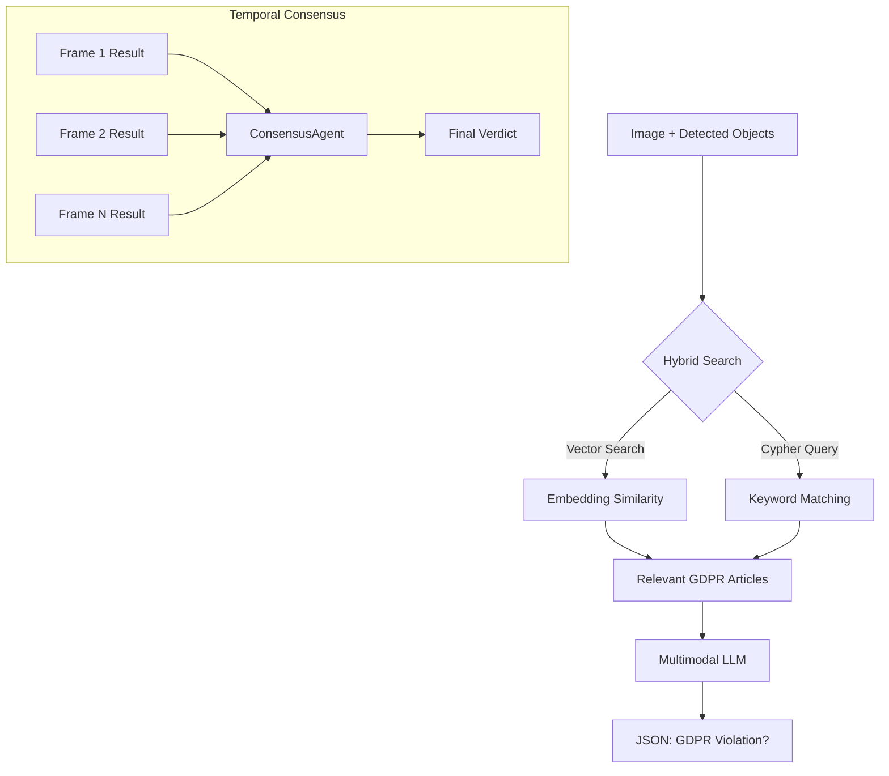

# Verification Module - GDPR Compliance Intelligence System

## Overview

The **Verification Module** is the AI-powered legal decision engine of OccultaShield. It implements a sophisticated multi-agent architecture that combines:

- **Neo4j Knowledge Graph** with GDPR regulations and semantic embeddings
- **Gemma LLM** (multimodal) for visual analysis
- **Temporal Consensus** for robust decision-making across video frames
- **"Witness vs. Judge" Architecture** for separation of concerns

This module determines whether detected objects in video frames constitute GDPR violations and recommends appropriate anonymization actions based on legal context and visual analysis.

---

## Architecture Overview

```
┌─────────────────────────────────────────────────────────────────────────────────┐
│                         VERIFICATION SYSTEM ARCHITECTURE                        │
├─────────────────────────────────────────────────────────────────────────────────┤
│                                                                                  │
│    ┌─────────────────────────────────────────────────────────────────────────┐  │
│    │                         PARALLEL PROCESSOR                               │  │
│    │  ┌───────────┐  ┌───────────┐  ┌───────────┐  ┌───────────┐            │  │
│    │  │ SubAgent  │  │ SubAgent  │  │ SubAgent  │  │ SubAgent  │  ...       │  │
│    │  │ Track 1   │  │ Track 2   │  │ Track 3   │  │ Track N   │            │  │
│    │  └─────┬─────┘  └─────┬─────┘  └─────┬─────┘  └─────┬─────┘            │  │
│    │        │              │              │              │                   │  │
│    │        ▼              ▼              ▼              ▼                   │  │
│    │  ┌─────────────────────────────────────────────────────────────────┐   │  │
│    │  │                    CONSENSUS AGENT                               │   │  │
│    │  │         (Temporal Aggregation + Legal Decision)                  │   │  │
│    │  └─────────────────────────────────────────────────────────────────┘   │  │
│    └─────────────────────────────────────────────────────────────────────────┘  │
│                                                                                  │
│                    ┌──────────────┐     ┌──────────────────────┐                │
│                    │  GemmaClient │     │    GraphDB/Client    │                │
│                    │  (WITNESS)   │     │    (Neo4j + GDPR)    │                │
│                    │              │     │                      │                │
│                    │  "I see a    │     │  Article 6, 9...     │                │
│                    │   person in  │     │  Biometric data...   │                │
│                    │   hospital   │     │  Processing rules... │                │
│                    │   gown"      │     │                      │                │
│                    └──────────────┘     └──────────────────────┘                │
│                                                                                  │
└─────────────────────────────────────────────────────────────────────────────────┘
```

---

## File Structure

```
verification/
├── __init__.py              # Module exports and entry points
├── parallel_processor.py    # Orchestrates parallel SubAgents + Consensus
├── sub_agent.py             # Individual verification agent
├── consensus_agent.py       # Temporal consensus + Legal "Judge"
├── gemma_client.py          # LLM client (visual analysis = "Witness")
├── graph_client.py          # Async Neo4j client with caching
├── graph_db.py              # Neo4j connection + hybrid search
├── graph_rag.py             # Full GraphRAG workflow (LangGraph)
├── ingest_gdpr.py           # GDPR PDF ingestion into Neo4j
├── Verification_usage.md    # Additional usage documentation
└── README.md                # This documentation
```

---

## Core Components

### 1. `ParallelProcessor` Class

The orchestrator that manages parallel verification of multiple tracks using asyncio.

#### Location
`parallel_processor.py`

#### Initialization

```python
class ParallelProcessor:
    def __init__(self, max_workers: int = 4):
        self.semaphore = asyncio.Semaphore(max_workers)  # Concurrency limit
        self.consensus_agent = ConsensusAgent()
```

#### Key Methods

##### `process_batch(video_id, image_path, detections) -> List[Dict]`

Process multiple detections for a single image/frame.

```python
async def process_batch(self, video_id: str, image_path: str, 
                         detections: List[Dict]) -> List[Dict]:
    requests = [{"image_path": image_path, "detection": d} for d in detections]
    return await self.process_requests(video_id, requests)
```

##### `process_requests(video_id, requests) -> List[Dict]`

The main processing method implementing **Temporal Consensus**:

**Algorithm:**
1. **Group by Track ID**: Organizes detection requests by `track_id`
2. **Parallel Frame Processing**: For each track, processes all frames in parallel
3. **Consensus Aggregation**: Applies `ConsensusAgent.aggregate()` to frame results
4. **Progress Reporting**: Updates progress manager with verification status

```python
async def process_requests(self, video_id: str, requests: List[Dict]) -> List[Dict]:
    # Group requests by track_id
    track_requests: Dict[int, List[Dict]] = defaultdict(list)
    for req in requests:
        track_id = req["detection"].get("track_id")
        track_requests[track_id].append(req)
    
    for track_id, track_reqs in track_requests.items():
        # Process all frames for this track in parallel
        frame_tasks = [self._process_single(req["image_path"], req["detection"]) 
                       for req in track_reqs]
        frame_results = await asyncio.gather(*frame_tasks)
        
        # Aggregate via ConsensusAgent
        consensus_result = self.consensus_agent.aggregate(list(frame_results))
        final_results.append(consensus_result)
    
    return final_results
```

##### `_process_single(image_path, detection) -> Dict`

Processes a single detection using a `SubAgent`:

```python
async def _process_single(self, image_path: str, detection: Dict) -> Dict:
    async with self.semaphore:  # Concurrency control
        agent = SubAgent(agent_id=f"agent-{detection.get('detection_type')}")
        result = await agent.verify(image_path, detection)
        result["frame"] = detection.get("frame")
        result["timestamp"] = detection.get("timestamp")
        return result
```

---

### 2. `SubAgent` Class

Individual verification agent responsible for a single detection.

#### Location
`sub_agent.py`

#### Role
Orchestrates the retrieval of legal context (from Neo4j) and visual analysis (from Gemma).

```python
class SubAgent:
    def __init__(self, agent_id: str):
        self.agent_id = agent_id
        self.graph_client = GraphClient()  # Neo4j connection
        self.gemma_client = GemmaClient()  # LLM for analysis
```

#### Verification Flow

```python
async def verify(self, image_path: str, detection: Dict) -> Dict:
    detection_type = detection.get("detection_type", "unknown")
    
    # 1. Retrieve GDPR context from Knowledge Graph
    context = await self.graph_client.get_context_for_detection(detection_type)
    
    # 2. Analyze with Gemma LLM
    analysis_result = await self.gemma_client.analyze_image(
        image_path=image_path,
        context=context,
        detection_type=detection_type
    )
    
    # 3. Augment result with agent metadata
    analysis_result["agent_id"] = self.agent_id
    analysis_result["detection_id"] = detection.get("id")
    
    return analysis_result
```

---

### 3. `ConsensusAgent` Class

The **"Judge"** in the Witness-Judge architecture. Makes legal decisions based on aggregated evidence.

#### Location
`consensus_agent.py`

#### The "Witness vs. Judge" Architecture

This is a key architectural decision for reliable GDPR compliance:

| Role | Component | Responsibility |
|------|-----------|----------------|
| **Witness** | GemmaClient | Objectively describes what is seen in the image |
| **Judge** | ConsensusAgent | Makes legal decisions based on descriptions + GDPR rules |

**Why separate?**
- The LLM (Witness) can hallucinate about legal matters
- Legal rules are deterministic and should be applied consistently
- Easier to audit and explain decisions

#### Vulnerable Context Detection

The ConsensusAgent maintains dictionaries of keywords that indicate vulnerable contexts requiring extra protection:

```python
VULNERABLE_CONTEXTS = {
    "medical": ["hospital", "medical_setting", "clinic", "patient", ...],
    "minor": ["child", "minor", "kid", "teenager", "school", ...],
    "religious": ["religious_symbol", "church", "mosque", ...],
    "political": ["protest", "demonstration", "political", ...],
    "intimate": ["swimwear", "minimal", "underwear", ...],
    "ethnic": ["ethnic_clothing", "traditional_dress", ...],
}

NORMAL_CONTEXTS = {
    "public_space": ["street", "sidewalk", "park", "plaza", ...],
    "workplace": ["office", "workplace", "meeting", ...],
    "commercial": ["shop", "store", "mall", "restaurant", ...],
    "recreational": ["beach", "pool", "gym", "sports", ...],
    "transport": ["airport", "station", "bus", "train", ...],
}
```

#### Key Methods

##### `aggregate_and_decide(track_id, frame_results, detection_type) -> Dict`

**Main "Judge" method** for person detections:

```python
async def aggregate_and_decide(
    self, track_id: str, frame_results: List[Dict], detection_type: str
) -> Dict:
    # For non-"person" types, use classic aggregate
    if detection_type != "person":
        return self.aggregate(frame_results)
    
    # STEP 1: Consolidate visual descriptions from all frames
    consolidated = self._consolidate_visual_descriptions(frame_results)
    all_tags = consolidated["all_tags"]
    all_environments = consolidated["all_environments"]
    
    # STEP 2: Query Neo4j for legal context
    legal_context = await self._query_legal_context(list(all_tags))
    
    # STEP 3: Apply "Golden Rule" - Vulnerable vs. Normal context
    vulnerability_analysis = self._analyze_vulnerability(
        tags=all_tags,
        environments=all_environments,
        context_indicators=consolidated["all_context_indicators"],
        age_groups=consolidated["age_groups"]
    )
    
    # STEP 4: Emit legal verdict
    if vulnerability_analysis["is_vulnerable"]:
        return self._build_violation_verdict(...)
    else:
        return self._build_no_violation_verdict(...)
```

##### The "Golden Rule"

```
┌─────────────────────────────────────────────────────────────────────────┐
│                           GOLDEN RULE                                   │
├─────────────────────────────────────────────────────────────────────────┤
│                                                                         │
│  Person in NORMAL context (street, office, beach):                      │
│    → is_violation: FALSE                                                │
│    → Only blur the FACE (separate track)                                │
│    → Don't censor the body                                              │
│                                                                         │
│  Person in VULNERABLE context (hospital, protest, child):               │
│    → is_violation: TRUE                                                 │
│    → Censor ENTIRE BODY                                                 │
│    → Extra blur/obscuration                                             │
│    → Cite specific GDPR articles (Art. 9, Recital 38, etc.)             │
│                                                                         │
└─────────────────────────────────────────────────────────────────────────┘
```

##### `aggregate(results) -> Dict`

Classic temporal consensus aggregation for non-person detections:

**Strategy:**
1. **Union-of-Evidence**: If ANY frame is positive → violation confirmed
2. **Article Consolidation**: Merge violated_articles from all frames
3. **Severity Escalation**: Persistent violations (3+ frames) → Critical
4. **Action Priority**: Most severe action wins (mask > pixelate > blur > none)

```python
def aggregate(self, results: List[Dict]) -> Dict:
    # Union of Evidence
    violations = [r for r in results if r.get("is_violation")]
    is_violation = len(violations) > 0
    
    # Aggregate Confidence
    confidences = [r.get("confidence", 0.0) for r in results]
    avg_confidence = sum(confidences) / len(confidences)
    
    # Merge Articles
    all_articles = set()
    for r in results:
        all_articles.update(r.get("violated_articles", []))
    
    # Severity Escalation
    if is_violation:
        violation_count = len(violations)
        if violation_count >= 3: severity = "critical"
        elif violation_count >= 2: severity = "high"
        else: severity = violations[0].get("severity", "medium")
    
    # Best Action (most severe)
    action_priority = {"mask": 4, "pixelate": 3, "blur": 2, "none": 1}
    best_action = max(violations, key=lambda v: action_priority.get(v.get("recommended_action"), 0))
    
    return {...}
```

##### `_analyze_vulnerability(tags, environments, context_indicators, age_groups) -> Dict`

Determines if the context is vulnerable based on GDPR categories:

```python
def _analyze_vulnerability(self, tags, environments, context_indicators, age_groups):
    all_indicators_lower = {str(i).lower() for i in tags | environments | context_indicators}
    
    # Check each vulnerability type
    for vuln_type, keywords in VULNERABLE_CONTEXTS.items():
        matching = all_indicators_lower & set(keywords)
        if matching:
            # Special case: minors get extra protection
            if vuln_type == "minor" or "child" in age_groups:
                return {
                    "is_vulnerable": True,
                    "vulnerability_type": "minor",
                    "reason": "Minor detected. Special protection required (Recital 38 GDPR).",
                    "confidence": 0.95
                }
            
            return {
                "is_vulnerable": True,
                "vulnerability_type": vuln_type,
                "confidence": 0.85 if len(matching) >= 2 else 0.75
            }
    
    # Default: unknown context → treated as normal (proportionality principle)
    return {"is_vulnerable": False, "confidence": 0.60}
```

---

### 4. `GemmaClient` Class

The **"Witness"** - provides objective visual descriptions without legal judgment.

#### Location
`gemma_client.py`

#### Model Configuration

```python
class GemmaClient:
    _instance = None  # Singleton pattern
    
    def __init__(self):
        self.model_id = config.verification.get("llm_model", "google/gemma-3-4b-it")
        self.device = "cuda" if torch.cuda.is_available() else "cpu"
        self.model = None  # Lazy loading
        self.processor = None
        self._classification_cache = {}
```

#### Dual Mode Operation

The GemmaClient operates in two modes depending on detection type:

| Detection Type | Mode | Output |
|---------------|------|--------|
| `person` | **Witness Mode** | Visual description only (no `is_violation`) |
| `face`, `license_plate`, etc. | **Direct Mode** | Immediate violation decision |

#### Witness Mode: Visual Description Prompt

```python
VISUAL_DESCRIPTION_PROMPT = """
You are a VISUAL WITNESS. Your job is to DESCRIBE what you see, NOT to make legal judgments.

Analyze this image of a person and provide an OBJECTIVE VISUAL DESCRIPTION.

Respond with a JSON object containing:
{
  "visual_summary": "Detailed description of the person: clothing, posture, activity, environment",
  "tags": ["list", "of", "relevant", "keywords"],
  "environment": "Description of the setting (e.g., beach, hospital, office, street)",
  "clothing_level": "formal|casual|athletic|swimwear|medical|minimal|uniform|religious",
  "visible_biometrics": {...},
  "context_indicators": ["list", "of", "contextual", "clues"],
  "age_group": "child|teenager|adult|elderly|unknown",
  "confidence": 0.0 to 1.0
}

IMPORTANT: Be OBJECTIVE. DO NOT judge if this is a "violation" - that's not your job.
"""
```

#### Sensitive Content Classification

For unknown objects (like hands), the GemmaClient can classify:

```python
SENSITIVE_CONTENT_CLASSIFICATION_PROMPT = """
Analyze this image crop for sensitive content:

1. **Fingerprint**: Visible ridge patterns on fingertips
2. **ID Document**: Passport, national ID, driver's license
3. **Credit Card**: Bank card showing numbers or chip
4. **Signature**: Handwritten signature
5. **Hand with biometric features**: Palm print

Respond with JSON:
{
  "detected_type": "fingerprint|id_document|credit_card|signature|hand_biometric|none",
  "confidence": 0.0 to 1.0,
  "reasoning": "Brief explanation"
}
"""
```

#### GDPR Article Mapping

Direct violations are mapped to specific articles:

```python
GDPR_ARTICLES = {
    "face": ["9", "6"],           # Biometric data
    "fingerprint": ["9", "6"],    # Biometric data
    "license_plate": ["6", "17"], # Personal data + Right to erasure
    "person": ["6", "13"],        # Processing + Information rights
    "id_document": ["9", "6", "32"],  # Special categories + Security
    "credit_card": ["6", "32"],   # Processing + Security
    "signature": ["6"],           # Personal data
}
```

#### Mock Mode

When the LLM is unavailable, the client uses filename-based heuristics:

```python
def _mock_visual_description(self, image_path: str) -> Dict:
    path_lower = image_path.lower()
    
    if any(kw in path_lower for kw in ["beach", "playa", "swim"]):
        return {
            "visual_summary": "Person in swimsuit at beach",
            "tags": ["swimwear", "beach", "outdoor", "recreational"],
            "environment": "outdoor_beach",
            "clothing_level": "swimwear",
            ...
        }
    elif any(kw in path_lower for kw in ["hospital", "medical"]):
        return {...}  # Medical context
    
    # Default: normal context
    return {
        "visual_summary": "Adult person in casual clothing in public space",
        ...
    }
```

---

### 5. `GraphClient` Class

Async Neo4j client with context caching.

#### Location
`graph_client.py`

#### Features

- **Singleton Pattern**: Single connection instance
- **Context Caching**: 5-minute TTL cache for repeated queries
- **Async Operations**: Non-blocking database access
- **Graceful Fallback**: Mock responses when DB is unavailable

```python
class GraphClient:
    _instance = None
    
    def __new__(cls):
        if cls._instance is None:
            cls._instance = super().__new__(cls)
            cls._instance._init_driver()
            cls._instance._context_cache = {}
            cls._instance._cache_timestamps = {}
        return cls._instance
```

#### Key Methods

##### `get_context_for_detection(detection_type) -> List[Dict]`

Retrieves GDPR articles relevant to a detection type:

```python
async def get_context_for_detection(self, detection_type: str) -> List[Dict]:
    cache_key = f"context:{detection_type}"
    
    # Check cache first
    if cache_key in self._context_cache and self._is_cache_valid(cache_key):
        return self._context_cache[cache_key]
    
    # Query Neo4j
    async with self.driver.session() as session:
        result = await session.run(
            GDPRQueries.GET_ARTICLES_FOR_DETECTION,
            {"detection_type": detection_type}
        )
        records = await result.data()
    
    # Update cache
    self._context_cache[cache_key] = records
    self._cache_timestamps[cache_key] = time.time()
    
    return records
```

##### `semantic_search(embedding, threshold, limit) -> List[Dict]`

Vector similarity search using embeddings:

```python
async def semantic_search(self, embedding: List[float], 
                          threshold: float = 0.7, limit: int = 5):
    async with self.driver.session() as session:
        result = await session.run(
            GDPRQueries.SEMANTIC_SEARCH,
            {"query_embedding": embedding, "threshold": threshold, "limit": limit}
        )
        return await result.data()
```

---

### 6. `GraphDB` Class

Full Neo4j connection manager supporting multiple access patterns.

#### Location
`graph_db.py`

#### Capabilities

1. **Neo4jGraph**: Direct Cypher queries
2. **Neo4jVector**: Semantic/vector similarity search
3. **GraphCypherQAChain**: Natural language to Cypher (advanced)

```python
class GraphDB:
    _instance = None  # Singleton
    
    def connect(self) -> "GraphDB":
        # 1. Connect to Neo4jGraph
        self.graph = Neo4jGraph(url=url, username=username, password=password)
        
        # 2. Initialize embeddings
        self.embeddings = HuggingFaceEmbeddings(
            model_name=os.getenv("EMBEDDING_MODEL"),
            model_kwargs={'device': 'cpu'},
            encode_kwargs={'normalize_embeddings': True}
        )
        
        # 3. Connect to vector store
        self.vector_store = Neo4jVector.from_existing_graph(
            embedding=self.embeddings,
            index_name="gdpr_vector_index",
            node_label="GDPRArticle",
            text_node_properties=["content", "title"],
            embedding_node_property="embedding"
        )
```

#### Hybrid Search

The `hybrid_search` method combines vector and keyword search:

```python
def hybrid_search(self, query: str, detected_objects: List[str], k: int = 5) -> List[str]:
    context = []
    seen_titles = set()
    
    # PART 1: Vector/Semantic Search
    if self.vector_store:
        semantic_query = f"GDPR regulations about {', '.join(detected_objects)}"
        vector_results = self.vector_search(semantic_query, k=k)
        for result in vector_results:
            title = result["metadata"]["title"]
            if title not in seen_titles:
                seen_titles.add(title)
                context.append(f"**{title}** [Relevance: {score:.2f}]\n{content}")
    
    # PART 2: Cypher Keyword Search (fallback/supplement)
    keyword_mapping = {
        "face": ["biometric", "facial", "special categories", "consent"],
        "person": ["personal data", "data subject", "processing"],
        ...
    }
    # ... keyword search logic
    
    # PART 3: Fallback if nothing found
    if not context:
        context = [
            "**GDPR Article 5 - Principles**\n...",
            "**GDPR Article 6 - Lawfulness**\n...",
            "**GDPR Article 9 - Special Categories**\n...",
        ]
    
    return context[:k]
```

---

### 7. `GDPRVerificationGraph` Class

Full GraphRAG workflow using LangGraph.

#### Location
`graph_rag.py`

#### LangGraph State

```python
class VerificationState(TypedDict):
    image_path: str
    detected_objects: List[str]
    retrieved_context: List[str]
    verification_result: Dict[str, Any]
```

#### Workflow

```python
def _build_workflow(self) -> Any:
    workflow = StateGraph(VerificationState)
    
    # Add nodes
    workflow.add_node("retrieve_context", self._retrieve_gdpr_context)
    workflow.add_node("verify_vulnerability", self._verify_vulnerability)
    
    # Define flow
    workflow.set_entry_point("retrieve_context")
    workflow.add_edge("retrieve_context", "verify_vulnerability")
    workflow.add_edge("verify_vulnerability", END)
    
    return workflow.compile()
```

#### Verification Prompt

```python
prompt_text = """You are an expert GDPR Compliance Analyst AI.

## TASK
Analyze the provided image for potential GDPR violations.

## DETECTED ELEMENTS
The following elements were detected: [{objects}]

## RELEVANT GDPR ARTICLES
{context}

## INSTRUCTIONS
1. Examine the image carefully
2. Determine if detected elements constitute personal data requiring protection
3. Check if exposing this data would violate referenced GDPR articles
4. Consider: Are faces visible? License plates readable? Identifiable information?

## REQUIRED OUTPUT FORMAT
Return ONLY a valid JSON:
{
    "is_violation": true or false,
    "violated_articles": ["Article X", "Article Y"],
    "detected_personal_data": ["type1", "type2"],
    "description": "Detailed explanation",
    "severity": "Critical|High|Medium|Low|None",
    "recommended_action": "What to do for GDPR compliance",
    "confidence": 0.0 to 1.0
}
"""
```

---

### 8. `ingest_gdpr.py` - Knowledge Graph Population

Script to ingest GDPR PDF documents into Neo4j with vector embeddings.

#### Location
`ingest_gdpr.py`

#### Usage

```bash
# From local PDF
python ingest_gdpr.py local:path/to/gdpr.pdf

# From Kaggle dataset
python ingest_gdpr.py kaggle:username/dataset-identifier
```

#### Ingestion Steps

1. **Load PDF**: Uses `PyPDFLoader` from LangChain
2. **Split into chunks**: `RecursiveCharacterTextSplitter` with GDPR-aware separators
3. **Process metadata**: Extract article titles, determine fine tiers
4. **Load embeddings**: HuggingFace `sentence-transformers/all-MiniLM-L6-v2`
5. **Create vector store**: Neo4jVector with embeddings
6. **Create indexes**: Full-text index for keyword search

```python
def ingest_gdpr_pdf(pdf_path: str, clear_existing: bool = False):
    # 1. Load PDF
    loader = PyPDFLoader(pdf_path)
    documents = loader.load()
    
    # 2. Split text
    text_splitter = RecursiveCharacterTextSplitter(
        chunk_size=1000,
        chunk_overlap=200,
        separators=["\nArticle ", "\nArtículo ", "\n\n", "\n", ". ", " "]
    )
    chunks = text_splitter.split_documents(documents)
    
    # 3. Process chunks
    for chunk in chunks:
        # Determine fine tier
        if any(kw in content_lower for kw in ["biometric", "special categories", "children"]):
            fine_tier = "High"
        # ...
    
    # 4. Create vector store
    vector_store = Neo4jVector.from_documents(
        documents=processed_docs,
        embedding=embeddings,
        index_name="gdpr_vector_index",
        node_label="GDPRArticle",
        ...
    )
    
    # 5. Create fulltext index
    graph.query("""
        CREATE FULLTEXT INDEX gdpr_fulltext_index IF NOT EXISTS
        FOR (n:GDPRArticle)
        ON EACH [n.content, n.title]
    """)
```

---

## Module Public Interface

#### `__init__.py`

```python
from modules.verification.parallel_processor import ParallelProcessor

processor = ParallelProcessor()

async def verify_image_detections(image_path: str, detections: List[Dict]) -> List[Dict]:
    """Verify a list of detections for a single image against GDPR rules."""
    return await processor.process_batch(image_path, detections)

async def verify_video_content(video_id: str, frame_data: List[Dict]) -> List[Dict]:
    """Verify content for an entire video."""
    results = []
    for frame in frame_data:
        frame_results = await verify_image_detections(
            frame["image_path"], 
            frame["detections"]
        )
        results.extend(frame_results)
    return results
```

---

## Detection Types and GDPR Articles

| Detection Type | GDPR Articles | Severity | Recommended Action |
|---------------|---------------|----------|-------------------|
| `face` | 9, 6 | High | blur |
| `fingerprint` | 9, 6 | High | blur |
| `license_plate` | 6, 17 | High | pixelate |
| `person` (vulnerable) | 9, 6, 8 | High | blur |
| `person` (normal) | - | None | face only |
| `id_document` | 9, 6, 32 | High | blur |
| `credit_card` | 6, 32 | High | pixelate |
| `signature` | 6 | Medium | blur |
| `hand_biometric` | 9, 6 | High | blur |

---

## Vulnerability Classifications

### Vulnerable Contexts (→ Full Body Censorship)

| Context | Keywords | GDPR Reference |
|---------|----------|----------------|
| **Medical** | hospital, clinic, patient, medical_gown | Art. 9.1 (Health data) |
| **Minor** | child, teenager, school, playground | Recital 38 (Children) |
| **Religious** | church, mosque, religious_symbol | Art. 9.1 (Beliefs) |
| **Political** | protest, demonstration, rally | Art. 9.1 (Opinions) |
| **Intimate** | swimwear, nudity, bathroom | Art. 9.1 (Dignity) |
| **Ethnic** | ethnic_clothing, traditional_dress | Art. 9.1 (Origin) |

### Normal Contexts (→ Face Only)

| Context | Keywords |
|---------|----------|
| **Public Space** | street, park, plaza, outdoor |
| **Workplace** | office, meeting, conference |
| **Commercial** | shop, mall, restaurant |
| **Recreational** | beach, pool, gym, sports |
| **Transport** | airport, station, bus, train |

---

## Configuration

### Environment Variables

| Variable | Description | Required |
|----------|-------------|----------|
| `NEO4J_URI` | Neo4j connection URI | Yes |
| `NEO4J_USER` | Neo4j username | Yes |
| `NEO4J_PASSWORD` | Neo4j password | Yes |
| `EMBEDDING_MODEL` | HuggingFace embedding model | Yes |
| `MULTIMODAL_MODEL_ID` | LLM model ID | No (default: gemma-3n) |

### Example `.env`

```env
NEO4J_URI=bolt://localhost:7687
NEO4J_USER=neo4j
NEO4J_PASSWORD=your_password
EMBEDDING_MODEL=sentence-transformers/all-MiniLM-L6-v2
MULTIMODAL_MODEL_ID=google/gemma-3n-E4B-it
```

---

## Dependencies

### Required
- `neo4j` - Neo4j Python driver (async)
- `langchain-neo4j` - LangChain Neo4j integration
- `langchain-community` - Document loaders and embeddings
- `langgraph` - Workflow orchestration
- `transformers` - Hugging Face model loading
- `torch` - PyTorch for inference
- `Pillow` - Image processing

### Optional
- `kaggle` - For downloading GDPR datasets

---

## Usage Examples

### Single Image Verification

```python
from modules.verification import verify_image_detections

detections = [
    {"detection_type": "face", "id": 1, "track_id": 1, "bbox": [100, 100, 200, 200]},
    {"detection_type": "person", "id": 2, "track_id": 2, "bbox": [50, 50, 300, 400]},
]

results = await verify_image_detections(
    image_path="/path/to/frame.jpg",
    detections=detections
)

for result in results:
    if result["is_violation"]:
        print(f"Violation: {result['reasoning']}")
        print(f"Articles: {result['violated_articles']}")
        print(f"Action: {result['recommended_action']}")
```

### Video Verification with Temporal Consensus

```python
from modules.verification import verify_video_content

frame_data = [
    {"image_path": "/frames/001.jpg", "detections": [...]},
    {"image_path": "/frames/002.jpg", "detections": [...]},
    # ...
]

results = await verify_video_content(
    video_id="vid_12345",
    frame_data=frame_data
)

# Results are aggregated by track_id with temporal consensus
```

---

## GDPR Knowledge Graph Setup

### 1. Start Neo4j

```bash
docker run -d \
  --name neo4j \
  -p 7474:7474 -p 7687:7687 \
  -e NEO4J_AUTH=neo4j/password \
  neo4j:5.x
```

### 2. Ingest GDPR Document

```bash
cd backend/app/modules/verification
python ingest_gdpr.py local:../../../data/gdpr_full_text.pdf
```

### 3. Verify Ingestion

```bash
# In Neo4j Browser
MATCH (n:GDPRArticle) RETURN count(n);
# Should return > 0

CALL db.index.vector.queryNodes('gdpr_vector_index', 3, <test_embedding>);
```

---

## Error Handling

The module handles various failure scenarios:

1. **Neo4j unavailable**: Falls back to mock GDPR context
2. **LLM not loaded**: Uses filename-based heuristics
3. **Image not found**: Returns error result with `is_violation: None`
4. **JSON parsing failure**: Extracts partial JSON or returns raw response

```python
# Example error handling in SubAgent
async def _process_single(self, image_path, detection):
    try:
        result = await agent.verify(image_path, detection)
        return result
    except Exception as e:
        return {
            "is_violation": False, 
            "error": str(e), 
            "confidence": 0
        }
```

---

## Performance Considerations

1. **Context Caching**: 5-minute TTL prevents repeated Neo4j queries
2. **Semaphore Control**: Limits concurrent LLM inference
3. **Lazy Model Loading**: LLM only loaded when first needed
4. **Singleton Patterns**: Reuses DB connections and model instances
5. **Batch Processing**: Groups frames by track for efficient consensus

---

## Installation

### Dependencies

```bash
# Core dependencies
pip install torch torchvision transformers accelerate pillow
pip install langchain-neo4j langchain-community sentence-transformers
pip install langgraph pypdf python-dotenv

# Or using pyproject.toml
uv sync
# or
pip install -e .
```

### Neo4j Setup

The module requires a running Neo4j instance:

```bash
# Using Docker
docker-compose up -d neo4j

# Or standalone
docker run -d \
  --name neo4j \
  -p 7474:7474 -p 7687:7687 \
  -e NEO4J_AUTH=neo4j/password \
  neo4j:5.x
```

---

## Supported Models

| Model | Type | Requirements | Notes |
|-------|------|--------------|-------|
| `google/gemma-3-4b-it` | Multimodal | GPU recommended, HF login | Default model |
| `google/gemma-3n-E4B-it` | Multimodal | GPU, HF login | Optimized variant |
| `meta-llama/Llama-3.2-11B-Vision-Instruct` | Multimodal | GPU (24GB+), HF login | Higher accuracy |
| `sentence-transformers/all-MiniLM-L6-v2` | Embeddings | CPU compatible | Default embeddings |
| `sentence-transformers/all-mpnet-base-v2` | Embeddings | CPU compatible | Higher quality |

---

## Workflow Diagram



### Process Detail

1. **Input**: Image path + list of detected objects (e.g., `["face", "license_plate"]`)

2. **Hybrid Search**:
   - **Semantic**: Uses embeddings to find conceptually related articles
   - **Keywords**: Expands terms (e.g., `face` → `biometric`, `facial`, `consent`)
   - **Deduplication**: Removes duplicate results

3. **LLM Analysis**:
   - Loads image with PIL
   - Builds structured prompt with GDPR context
   - Generates JSON analysis

4. **Output**: Structured JSON with verification result

---

## Troubleshooting

### Error: "Model not loaded"

```
❌ Error loading model: ...
```

**Solutions:**
1. Verify you have access to the model on Hugging Face
2. Run `huggingface-cli login`
3. Ensure you have sufficient RAM/VRAM (8GB+ recommended for 4B models)

```bash
# Login to Hugging Face
huggingface-cli login

# Check available VRAM
nvidia-smi
```

### Error: "Vector store not initialized"

```
⚠️ Vector store not initialized (run ingest first)
```

**Solution:** Run the ingestion script first:

```bash
python -m modules.verification.ingest_gdpr local:path/to/gdpr.pdf
```

### Error: "Neo4j connection failed"

```
❌ Error connecting to Neo4jGraph: ...
```

**Solutions:**
1. Verify Neo4j is running: `docker ps | grep neo4j`
2. Check connection URI in `.env`
3. Ensure credentials are correct

```bash
# Test connection
cypher-shell -u neo4j -p your_password -a bolt://localhost:7687
```

### Slow Search Performance

If hybrid search is very slow:

1. **Use GPU** for the embedding model:
   ```python
   model_kwargs={'device': 'cuda'}
   ```

2. **Reduce `k`** in `hybrid_search()`:
   ```python
   results = db.hybrid_search(query, objects, k=3)  # Instead of 5
   ```

3. **Use a smaller embedding model**:
   ```env
   EMBEDDING_MODEL=sentence-transformers/all-MiniLM-L6-v2
   ```

### LLM Response Parsing Errors

If the LLM returns malformed JSON:

```
❌ Could not parse JSON from LLM response
```

**Solutions:**
1. The system has automatic fallback parsing
2. Check `raw_response` field for debugging
3. Consider using a more capable model

### Out of Memory (OOM)

```
CUDA out of memory
```

**Solutions:**
1. Reduce batch size in parallel processing
2. Use a smaller model
3. Enable memory optimizations:
   ```python
   model = AutoModelForCausalLM.from_pretrained(
       model_id,
       torch_dtype=torch.float16,  # Half precision
       low_cpu_mem_usage=True,
       device_map="auto"
   )
   ```

---

## Quick Start Guide

### 1. Start Neo4j

```bash
docker-compose up -d neo4j
# Wait for Neo4j to be ready
docker logs -f neo4j
```

### 2. Ingest GDPR Document

```bash
cd backend/app/modules/verification
python ingest_gdpr.py local:../../../data/gdpr_full_text.pdf
```

This creates:
- `GDPRArticle` nodes with content
- Vector embeddings for semantic search
- Fulltext index for keyword search

### 3. Verify an Image

```python
from modules.verification import verify_image_detections

# Objects detected by your detection system (YOLO, etc.)
detected_objects = ["face", "license_plate"]

# Run verification
result = await verify_image_detections(
    image_path="path/to/frame.jpg",
    detections=[
        {"detection_type": "face", "id": 1, "track_id": 1},
        {"detection_type": "license_plate", "id": 2, "track_id": 2}
    ]
)

print(result)
```

### 4. Direct Graph Usage

```python
from modules.verification.graph_rag import GDPRVerificationGraph

verifier = GDPRVerificationGraph()
result = verifier.run(
    image_path="frame.jpg",
    detected_objects=["face", "person"]
)
```

---

## API Response Format

### Successful Verification

```python
{
    "is_violation": True,
    "violated_articles": ["Article 9", "Article 6"],
    "detected_personal_data": ["face", "biometric data"],
    "description": "The image shows an unblurred face in a medical context...",
    "severity": "High",
    "recommended_action": "Apply blur to detected face",
    "confidence": 0.92,
    "track_id": 1,
    "frames_analyzed": 5,
    "mode": "judge_decision",
    "_metadata": {
        "model_used": "google/gemma-3-4b-it",
        "image_analyzed": "frame.jpg",
        "objects_detected": ["face"]
    }
}
```

### No Violation

```python
{
    "is_violation": False,
    "severity": "none",
    "confidence": 0.85,
    "reasoning": "No violation detected: Person in normal context (public_space). Face will be censored in its own track.",
    "recommended_action": "none",
    "track_id": 2,
    "frames_analyzed": 3,
    "mode": "judge_decision"
}
```

### Error Response

```python
{
    "is_violation": None,
    "error": "Image file not found: /path/to/missing.jpg",
    "confidence": 0
}
```

---

## License

This module is part of the OccultaShield project for the TFG (Bachelor's Thesis).

---

## Future Enhancements

- [ ] Multi-language GDPR support (Spanish, German, French)
- [ ] Real-time streaming verification
- [ ] Confidence calibration based on historical accuracy
- [ ] Integration with external legal APIs
- [ ] Support for additional privacy regulations (CCPA, LGPD)
- [ ] WebSocket support for real-time notifications
- [ ] Batch video processing optimization
- [ ] Custom vulnerability context definitions
