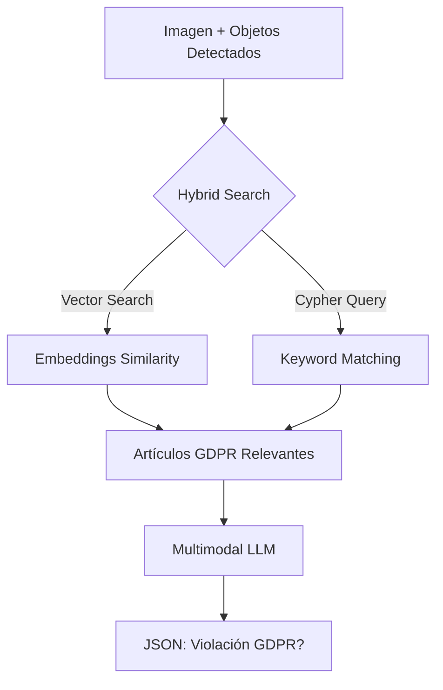

# 🛡️ Verification Module - OccultaShield

Este módulo implementa un sistema **GraphRAG (Graph Retrieval-Augmented Generation)** para verificar el cumplimiento del GDPR en imágenes y videos.

## 📋 Tabla de Contenidos

- [Arquitectura](#-arquitectura)
- [Componentes](#-componentes)
- [Flujo de Trabajo](#-flujo-de-trabajo)
- [Instalación](#-instalación)
- [Configuración](#-configuración)
- [Uso](#-uso)
- [API Reference](#-api-reference)

---

## 🏗️ Arquitectura

```
┌─────────────────────────────────────────────────────────────────┐
│                    VERIFICATION MODULE                          │
├─────────────────────────────────────────────────────────────────┤
│                                                                 │
│  ┌──────────────┐    ┌──────────────┐    ┌──────────────┐      │
│  │   Imagen +   │───▶│   HYBRID     │───▶│  Multimodal  │      │
│  │   Objetos    │    │   SEARCH     │    │     LLM      │      │
│  │  Detectados  │    │  (Neo4j)     │    │  (Gemma 3)   │      │
│  └──────────────┘    └──────────────┘    └──────────────┘      │
│                             │                    │              │
│                             ▼                    ▼              │
│                      ┌──────────────┐    ┌──────────────┐      │
│                      │   Artículos  │    │    JSON      │      │
│                      │    GDPR      │    │   Result     │      │
│                      └──────────────┘    └──────────────┘      │
│                                                                 │
└─────────────────────────────────────────────────────────────────┘
```

El módulo utiliza **LangGraph** para orquestar un flujo de trabajo de dos pasos:

1. **Recuperación de Contexto**: Búsqueda híbrida (semántica + keywords) en Neo4j
2. **Verificación con LLM**: Análisis multimodal de la imagen con contexto legal

---

## 📦 Componentes

### 1. `graph_db.py` - Gestor de Base de Datos

Maneja las conexiones a Neo4j con soporte para:

| Componente | Descripción |
|------------|-------------|
| `Neo4jGraph` | Queries Cypher directas |
| `Neo4jVector` | Búsqueda semántica con embeddings |
| `hybrid_search()` | Combina ambos métodos |

```python
from Verification_module.graph_db import GraphDB

db = GraphDB().connect()
results = db.hybrid_search(
    query="biometric data processing",
    detected_objects=["face", "person"],
    k=5
)
```

### 2. `graph_rag.py` - Motor de Verificación

Implementa el flujo GraphRAG usando LangGraph:

```
[START] → [retrieve_context] → [verify_vulnerability] → [END]
```

- **retrieve_context**: Busca artículos GDPR relevantes
- **verify_vulnerability**: Analiza la imagen con el LLM multimodal

### 3. `ingest_gdpr.py` - Script de Ingestión

Carga documentos GDPR en Neo4j con embeddings vectoriales.

---

## 🔄 Flujo de Trabajo



### Detalle del Proceso:

1. **Input**: Ruta de imagen + lista de objetos detectados (ej: `["face", "license_plate"]`)

2. **Búsqueda Híbrida**:
   - **Semántica**: Usa embeddings para encontrar artículos conceptualmente relacionados
   - **Keywords**: Expande términos (ej: `face` → `biometric`, `facial`, `consent`)
   - **Deduplicación**: Elimina resultados repetidos

3. **Análisis LLM**:
   - Carga la imagen con PIL
   - Construye un prompt estructurado con el contexto GDPR
   - Genera un análisis JSON

4. **Output**: JSON estructurado con el resultado

---

## 🛠️ Instalación

### Dependencias

```bash
pip install torch torchvision transformers accelerate pillow
pip install langchain-neo4j langchain-community sentence-transformers
pip install langgraph pypdf python-dotenv
```

O usando el `pyproject.toml`:

```bash
uv sync
# o
pip install -e .
```

### Neo4j

El módulo requiere una instancia de Neo4j corriendo. Usa Docker:

```bash
docker-compose up -d neo4j
```

---

## ⚙️ Configuración

Crea un archivo `.env` en la raíz del proyecto:

```env
# Neo4j
NEO4J_URI=bolt://localhost:7687
NEO4J_USER=root
NEO4J_PASSWORD=password

# Modelo de Embeddings (local, sin API key)
EMBEDDING_MODEL=sentence-transformers/all-MiniLM-L6-v2

# Modelo Multimodal (Hugging Face)
MULTIMODAL_MODEL_ID=google/gemma-3-4b-it
```

### Modelos Soportados

| Modelo | Tipo | Requisitos |
|--------|------|------------|
| `google/gemma-3-4b-it` | Multimodal | GPU recomendada, HF login |
| `meta-llama/Llama-3.2-11B-Vision-Instruct` | Multimodal | GPU, HF login |
| `sentence-transformers/all-MiniLM-L6-v2` | Embeddings | CPU compatible |

---

## 🚀 Uso

### 1. Ingestar el GDPR

Primero, carga el documento GDPR en Neo4j:

```bash
python -m Verification_module.ingest_gdpr "ruta/a/gdpr.pdf"
```

Esto creará:
- Nodos `GDPRArticle` con contenido
- Embeddings vectoriales para búsqueda semántica
- Índice fulltext para búsqueda por keywords

### 2. Verificar una Imagen

```python
from Verification_module import verify_video_content

# Objetos detectados por tu sistema de detección (YOLO, etc.)
detected_objects = ["face", "license_plate"]

# Ejecutar verificación
result = verify_video_content(
    image_path="ruta/a/frame.jpg",
    detected_objects=detected_objects
)

print(result)
```

### 3. Uso Directo del Grafo

```python
from Verification_module.graph_rag import GDPRVerificationGraph

verifier = GDPRVerificationGraph()
result = verifier.run(
    image_path="frame.jpg",
    detected_objects=["face", "person"]
)
```

---

## 📖 API Reference

### `verify_video_content(image_path, detected_objects)`

Función principal para verificar cumplimiento GDPR.

**Parámetros:**
| Nombre | Tipo | Descripción |
|--------|------|-------------|
| `image_path` | `str` | Ruta absoluta a la imagen |
| `detected_objects` | `List[str]` | Objetos detectados: `"face"`, `"person"`, `"license_plate"`, etc. |

**Retorna:** `Dict[str, Any]`

```python
{
    "is_violation": True,
    "violated_articles": ["Article 9", "Article 6"],
    "detected_personal_data": ["face", "biometric data"],
    "description": "La imagen muestra un rostro sin difuminar...",
    "severity": "High",
    "recommended_action": "Aplicar blur al rostro detectado",
    "confidence": 0.92,
    "_metadata": {
        "model_used": "google/gemma-3-4b-it",
        "image_analyzed": "frame.jpg",
        "objects_detected": ["face"]
    }
}
```

### `GraphDB.hybrid_search(query, detected_objects, k)`

Búsqueda híbrida en Neo4j.

**Parámetros:**
| Nombre | Tipo | Descripción |
|--------|------|-------------|
| `query` | `str` | Query en lenguaje natural |
| `detected_objects` | `List[str]` | Objetos para expandir keywords |
| `k` | `int` | Número máximo de resultados |

**Retorna:** `List[str]` - Artículos GDPR formateados

---

## 🗂️ Estructura de Archivos

```
Verification_module/
├── __init__.py           # Expone verify_video_content()
├── graph_db.py           # Conexión Neo4j + búsqueda híbrida
├── graph_rag.py          # LangGraph workflow + LLM
├── ingest_gdpr.py        # Script de ingestión de PDFs
└── Verification_usage.md # Esta documentación
```

---

## 🔧 Troubleshooting

### Error: "Model not loaded"

```
❌ Error loading model: ...
```

**Solución:**
1. Verifica que tienes acceso al modelo en Hugging Face
2. Ejecuta `huggingface-cli login`
3. Asegúrate de tener suficiente RAM/VRAM

### Error: "Vector store not initialized"

```
⚠️ Vector store not initialized (run ingest first)
```

**Solución:**
Ejecuta el script de ingestión primero:
```bash
python -m Verification_module.ingest_gdpr "gdpr.pdf"
```

### Búsqueda lenta

Si la búsqueda es muy lenta:
1. Usa GPU para el modelo de embeddings
2. Reduce `k` en `hybrid_search()`
3. Considera usar un modelo de embeddings más pequeño

---

## 📄 Licencia

Este módulo es parte del proyecto OccultaShield para el TFG.
