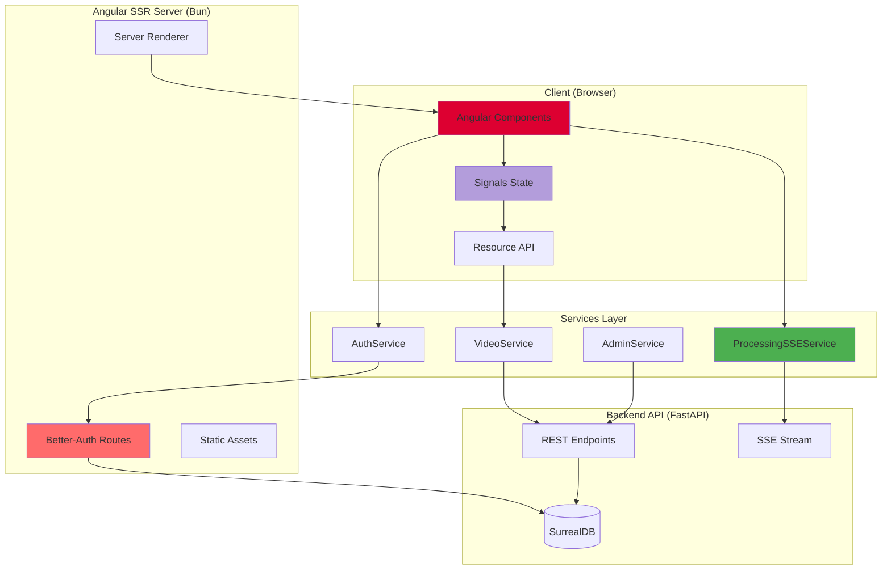
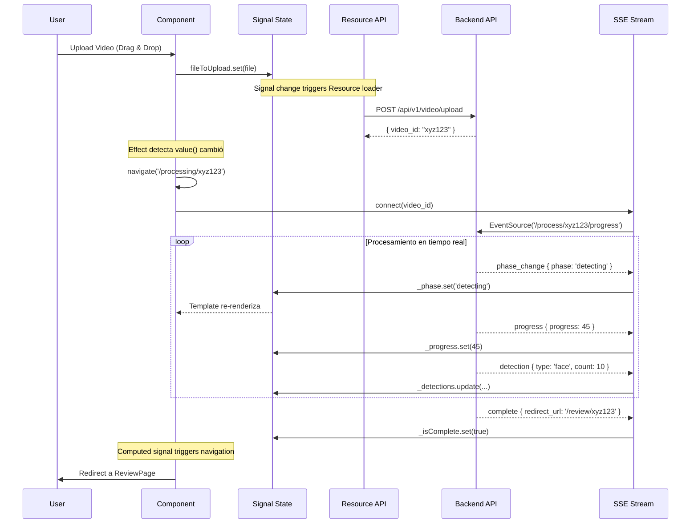

<div align="center">

# OccultaShield Frontend

### Interfaz de Usuario de Próxima Generación para Análisis GDPR de Videos

[](https://angular.io/)
[](https://www.typescriptlang.org/)
[](https://bun.sh/)
[](https://tailwindcss.com/)
[](https://better-auth.com/)

**Arquitectura Zoneless • Signals API • Server-Side Rendering • Real-time Updates**

[📖 Documentación Detallada](README_FRONTEND_DETAILED.md) • [🎯 Casos de Uso](#-casos-de-uso) • [🚀 Inicio Rápido](#-inicio-rápido)

</div>

---

## Tabla de Contenidos

- [Visión General](#-visión-general)
- [Arquitectura del Sistema](#-arquitectura-del-sistema)
- [Tecnologías Principales](#-tecnologías-principales)
- [Características Destacadas](#-características-destacadas)
- [Inicio Rápido](#-inicio-rápido)
- [Estructura del Proyecto](#-estructura-del-proyecto)
- [Servicios Principales](#-servicios-principales)
- [Componentes Destacados](#-componentes-destacados)
- [Sistema de Routing](#-sistema-de-routing)
- [Autenticación](#-autenticación)
- [Configuración](#-configuración)

---

## Visión General

**OccultaShield Frontend** es una aplicación Angular de vanguardia que representa el estado del arte en desarrollo web moderno (Diciembre 2025). Implementa las características más avanzadas de Angular 21, incluyendo arquitectura **Zoneless**, sistema de reactividad basado en **Signals**, y **Server-Side Rendering** optimizado.

### ¿Qué hace diferente a este frontend?

En lugar de usar patrones tradicionales de Angular, OccultaShield adopta el futuro del framework hoy:

1. **Sin Zone.js**: Rendimiento superior mediante arquitectura Zoneless
2. **Signals Everywhere**: Estado reactivo granular y predecible sin NgRx
3. **Resource API**: Gestión declarativa de datos asíncronos sin RxJS manual
4. **Signal Forms**: API experimental de formularios más simple y type-safe
5. **SSR Optimizado**: Renderizado del lado del servidor con Event Replay
6. **Real-time Updates**: Server-Sent Events (SSE) para procesamiento en tiempo real
7. **Better-Auth**: Autenticación moderna con soporte JWT y sesiones
8. **Bun Runtime**: Build y runtime 10-20x más rápido que Node.js

### Flujo de Usuario

```
Landing → Login → Upload → Processing (Real-time SSE) → Review → Processing (Editing) → Download
                                                           ↓
                                                    Admin Dashboard (solo admins)
```

---

## Arquitectura del Sistema

### Diagrama de Alto Nivel



### Flujo de Datos Reactivo



---

## Tecnologías Principales

### Stack Core

| Tecnología | Versión | Propósito |
|-----------|---------|-----------|
| **Angular** | 21.0.0 | Framework frontend progresivo |
| **TypeScript** | 5.9.2 | Lenguaje type-safe |
| **Bun** | 1.3.1 | Runtime y package manager ultra-rápido |
| **RxJS** | 7.8.0 | Programación reactiva |

### UI y Estilos

| Tecnología | Versión | Propósito |
|-----------|---------|-----------|
| **TailwindCSS** | 4.1.12 | Framework CSS utility-first |
| **PostCSS** | 8.5.3 | Transformaciones CSS |
| **Google Fonts** | - | Fuente Inter |
| **Material Symbols** | - | Iconografía |

### Autenticación y Backend

| Tecnología | Versión | Propósito |
|-----------|---------|-----------|
| **Better-Auth** | 1.4.5 | Sistema de autenticación moderno |
| **SurrealDB** | 1.3.2 | Base de datos multi-modelo |
| **Express** | 5.1.0 | Servidor HTTP para SSR |

### Build y Testing

| Tecnología | Versión | Propósito |
|-----------|---------|-----------|
| **Angular CLI** | 21.0.2 | Herramientas de desarrollo |
| **esbuild** | - | Bundler ultra-rápido (integrado) |
| **Vite** | - | Dev server con HMR (integrado) |
| **Vitest** | 4.0.8 | Framework de testing |

---

## Características Destacadas

### 1. Arquitectura Zoneless con Signals

**El futuro de Angular, hoy.**

```typescript
// Sin Zone.js, sin "magic" - Solo reactividad explícita
export class ProcessingSSEService {
  // Señales privadas (mutables)
  private readonly _phase = signal<ProcessingPhase>('idle');
  private readonly _progress = signal<number>(0);
  private readonly _detections = signal<Map<string, number>>(new Map());

  // Señales públicas (readonly)
  readonly phase = this._phase.asReadonly();
  readonly progress = this._progress.asReadonly();

  // Señales computadas (auto-memoization)
  readonly totalDetections = computed(() => {
    return Array.from(this._detections().values())
      .reduce((sum, count) => sum + count, 0);
  });

  // Effect para side-effects
  constructor() {
    effect(() => {
      if (this._isComplete()) {
        this.router.navigate(['/review', this.videoId()]);
      }
    });
  }
}
```

**Ventajas:**
- **Rendimiento**: Sin overhead de Zone.js (~7KB menos en bundle)
- **Predecibilidad**: Cambios explícitos, no "magic"
- **Granularidad**: Solo se actualizan componentes afectados
- **Type-safe**: TypeScript infiere tipos automáticamente

---

### 2. Resource API para Gestión de Datos Asíncronos

**No más subscriptions manuales, no más memory leaks.**

```typescript
export class UploadPage {
  // Signal que contiene el archivo seleccionado
  protected readonly fileToUpload = signal<File | undefined>(undefined);

  // Resource que se auto-ejecuta cuando fileToUpload cambia
  protected readonly uploadResource = resource({
    loader: async () => {
      const file = this.fileToUpload();
      if (!file) return null;

      // Conversión Observable → Promise
      const response = await firstValueFrom(
        this.videoService.uploadVideo(file)
      );
      return response;
    }
  });

  // Estados derivados automáticamente
  protected readonly isUploading = computed(() =>
    this.uploadResource.isLoading()
  );

  protected readonly uploadError = computed(() =>
    this.uploadResource.error()
  );

  // Navegación automática al completar
  constructor() {
    effect(() => {
      const response = this.uploadResource.value();
      if (response?.video_id) {
        this.router.navigate(['/processing', response.video_id]);
      }
    });
  }
}
```

**Template:**
```html
@if (uploadResource.isLoading()) {
  <div class="spinner">Uploading...</div>
}

@if (uploadResource.error()) {
  <div class="error">{{ uploadResource.error() }}</div>
}

@if (uploadResource.value()) {
  <div class="success">Upload complete!</div>
}
```

---

### 3. Signal Forms (Angular 21 Experimental)

**Formularios más simples, más type-safe.**

```typescript
export class LoginRegister {
  // Modelo reactivo
  protected loginCredentials = signal({
    email: '',
    password: '',
    rememberMe: false
  });

  // Formulario con validaciones declarativas
  protected loginForm = form(this.loginCredentials, (f) => {
    required(f.email, { message: 'Email is required' });
    email(f.email, { message: 'Invalid email format' });
    required(f.password);
    minLength(f.password, 8, { message: 'Min 8 characters' });
  });

  // Submit con validación automática
  onSubmit(event: Event) {
    event.preventDefault();

    submit(this.loginForm, async () => {
      const payload = this.loginCredentials();
      await this.authService.login(payload.email, payload.password);
    });
  }
}
```

**Ventajas:**
- **Sin FormControl/FormGroup**: API más simple
- **Type-safe**: Inferencia de tipos completa
- **Validación declarativa**: Funciones puras reutilizables
- **Auto-sync**: Modelo ↔ Vista siempre sincronizados

---

### 4. Server-Sent Events (SSE) en Tiempo Real

**Procesamiento de videos con feedback instantáneo.**

```typescript
export class ProcessingSSEService {
  connect(videoId: string): void {
    const url = `${environment.apiUrl}/process/${videoId}/progress`;
    this.eventSource = new EventSource(url);

    // Handlers tipados para eventos
    this.eventSource.addEventListener('phase_change', (event) => {
      const data = JSON.parse(event.data);
      this._phase.set(data.phase);
    });

    this.eventSource.addEventListener('progress', (event) => {
      const data = JSON.parse(event.data);
      this._progress.set(data.progress);
    });

    this.eventSource.addEventListener('detection', (event) => {
      const data = JSON.parse(event.data);
      this._detections.update(map => {
        map.set(data.detection_type, data.count);
        return new Map(map);  // Trigger signal update
      });
    });

    this.eventSource.addEventListener('complete', (event) => {
      this._isComplete.set(true);
      this.disconnect();
    });

    // Reconexión automática en caso de error
    this.eventSource.onerror = () => {
      if (this.reconnectAttempts() < 3) {
        setTimeout(() => this.connect(videoId), 2000);
        this.reconnectAttempts.update(n => n + 1);
      }
    };
  }
}
```

**Eventos SSE del Backend:**
- `initial_state`: Estado inicial al conectar
- `phase_change`: Cambio de fase (detecting → verifying → editing)
- `progress`: Actualización de % completado
- `detection`: Nueva detección encontrada
- `verification`: Resultado de verificación GDPR
- `complete`: Procesamiento terminado
- `error`: Error ocurrido
- `heartbeat`: Keep-alive cada 15s

---

### 5. Protección de Contenido Sensible

**ViolationCard con anti-screenshot.**

```typescript
export class ViolationCard {
  // Prevención de capturas de pantalla
  @HostListener('window:keydown', ['$event'])
  onKeyDown(event: KeyboardEvent): void {
    // PrintScreen
    if (event.key === 'PrintScreen') {
      this.hideImageForCapture();
    }

    // Ctrl+P (print), Ctrl+S (save)
    if (event.ctrlKey && ['p', 's'].includes(event.key)) {
      event.preventDefault();
      this.hideImageForCapture();
    }

    // Windows+Shift+S (screenshot tool)
    if (event.metaKey && event.shiftKey && event.key === 's') {
      event.preventDefault();
      this.hideImageForCapture();
    }
  }

  // Detección de herramientas externas
  @HostListener('window:blur')
  onWindowBlur(): void {
    if (this.isPreviewOpen()) {
      this.hideImageForCapture();
    }
  }

  private hideImageForCapture(): void {
    this.isImageHidden.set(true);
    setTimeout(() => this.isImageHidden.set(false), 1000);
  }
}
```

**Template con watermark:**
```html
<div class="image-preview"
     (contextmenu)="preventAction($event)"
     (dragstart)="preventAction($event)"
     draggable="false">

  @if (!isImageHidden()) {
    
  }

  <div class="watermark-overlay">
    <span>PREVIEW ONLY</span>
    <span>PREVIEW ONLY</span>
    <span>PREVIEW ONLY</span>
  </div>
</div>
```

---

### 6. Drag & Drop Avanzado

**FileDropDirective con captura global.**

```typescript
@Directive({
  selector: '[appFileDrop]',
  standalone: true
})
export class FileDropDirective implements OnInit, OnDestroy {
  readonly fileDropped = output<File>();
  readonly isDragActiveGlobal = signal<boolean>(false);

  private dragCounter = 0;

  ngOnInit(): void {
    // Listeners a nivel documento
    this.document.addEventListener('dragenter', this.boundDragEnter);
    this.document.addEventListener('dragover', this.boundDragOver);
    this.document.addEventListener('dragleave', this.boundDragLeave);
    this.document.addEventListener('drop', this.boundDrop);
  }

  private onDocumentDragEnter(evt: DragEvent): void {
    evt.preventDefault();
    this.dragCounter++;

    if (this.hasFiles(evt)) {
      this.isDragActiveGlobal.set(true);
    }
  }

  private onDocumentDragLeave(evt: DragEvent): void {
    evt.preventDefault();
    this.dragCounter--;

    if (this.dragCounter <= 0) {
      this.dragCounter = 0;
      this.isDragActiveGlobal.set(false);
    }
  }
}
```

**Ventajas:**
- **Captura global**: Drop funciona en toda la ventana
- **Contador anidado**: Evita flickering
- **Detección de tipo**: Solo acepta archivos
- **Feedback visual**: Estados reactivos con Signals

---

### 7. SSR Optimizado con Event Replay

**Hydration sin flickering.**

```typescript
// app.config.ts
export const appConfig: ApplicationConfig = {
  providers: [
    provideRouter(routes),
    provideClientHydration(withEventReplay()),  // ← Event Replay
    provideHttpClient(
      withFetch(),                              // ← Fetch API
      withInterceptors([authInterceptor])
    )
  ]
};
```

**¿Qué es Event Replay?**
- Los eventos del usuario (clicks, inputs) durante la carga se **capturan**
- Después de la hidratación, los eventos se **reproducen**
- **Sin pérdida** de interacciones del usuario
- **Sin flickers** de contenido

**Platform-aware code:**
```typescript
export class AuthService {
  private readonly platformId = inject(PLATFORM_ID);
  private readonly isBrowser = isPlatformBrowser(this.platformId);

  constructor() {
    // Solo ejecutar en navegador
    if (this.isBrowser) {
      this.checkSession();
      this.loadTokenFromStorage();
    }
  }
}
```

---

### 8. Path Aliases para Imports Limpios

**Subpath Imports configurados.**

```typescript
// Antes
import { AuthService } from '../../../services/auth.service';
import { authGuard } from '../../../guards/auth.guard';

// Después
import { AuthService } from '#services/auth.service';
import { authGuard } from '#guards/auth.guard';
```

**Configuración (package.json):**
```json
{
  "imports": {
    "#components/*": ["./src/app/components/*"],
    "#pages/*": ["./src/app/pages/*"],
    "#services/*": ["./src/app/services/*"],
    "#guards/*": ["./src/app/guards/*"],
    "#interceptors/*": ["./src/app/interceptors/*"],
    "#lib/*": ["./src/app/lib/*"],
    "#interface/*": ["./src/app/interface/*"],
    "#environments/*": ["./src/environments/*"],
    "#server/*": ["./server/lib/*"]
  }
}
```

---

## Inicio Rápido

### Prerrequisitos

- **Bun**: 1.3.1+ (package manager y runtime)
- **Node.js**: 20+ (opcional, para compatibilidad)
- **Backend**: Corriendo en `http://localhost:8900`
- **SurrealDB**: Para autenticación (Better-Auth)

### 1. Clonar e Instalar

```bash
# Navegar al frontend
cd frontend

# Instalar dependencias con Bun (10-20x más rápido)
bun install

# O con npm si prefieres
npm install
```

### 2. Configurar Variables de Entorno

```bash
# Copiar plantilla
cp .env.example .env

# Editar .env
nano .env
```

```bash
# .env
# Backend API
VITE_API_URL=http://localhost:8900/api/v1

# SurrealDB para Better-Auth
SURREAL_URL=http://localhost:8000
SURREAL_USER=root
SURREAL_PASS=root
SURREAL_NS=occultashield
SURREAL_DB=main

# Better-Auth
AUTH_SECRET=your-secret-key-here
AUTH_URL=http://localhost:4000
```

### 3. Desarrollo (Frontend Only)

```bash
# Dev server con Vite + HMR
ng serve

# O con npm
npm start
```

**Aplicación disponible en:** `http://localhost:4200`

**Características del dev server:**
- Hot Module Replacement (HMR) instantáneo
- Compilación incremental con esbuild
- Source maps para debugging
- Proxy automático al backend

### 4. Desarrollo (SSR + Full Stack)

```bash
# Build de producción + SSR
bun run build

# Iniciar servidor Bun con SSR
bun run serve:ssr
```

**Aplicación disponible en:** `http://localhost:4000`

**El servidor incluye:**
- Angular SSR rendering
- Rutas de autenticación Better-Auth (`/api/auth/*`)
- Rutas de administración (`/api/admin/*`)
- Archivos estáticos optimizados

### 5. Verificar Instalación

```bash
# Abrir en navegador
open http://localhost:4200

# O con SSR
open http://localhost:4000
```

**Deberías ver:**
- Landing page con animaciones
- Botón "Get Started" funcional
- Navegación a login/register

---

## Estructura del Proyecto

```
frontend/
├── src/
│   ├── app/
│   │   ├── components/          # Componentes "dumb" reutilizables
│   │   │   └── ViolationCard/
│   │   │       ├── ViolationCard.ts
│   │   │       └── ViolationCard.css
│   │   │
│   │   ├── directives/          # Directivas personalizadas
│   │   │   └── file-drop.ts     # Drag & Drop global
│   │   │
│   │   ├── guards/              # Guards de rutas
│   │   │   └── auth.guard.ts    # authGuard, roleGuard, guestGuard
│   │   │
│   │   ├── interceptors/        # Interceptores HTTP
│   │   │   └── auth.interceptor.ts  # Inyección JWT automática
│   │   │
│   │   ├── interface/           # Tipos TypeScript
│   │   │   ├── violation-models.ts
│   │   │   └── processing-events.ts
│   │   │
│   │   ├── lib/                 # Utilidades
│   │   │   └── auth-client.ts   # Cliente Better-Auth
│   │   │
│   │   ├── pages/               # Páginas "smart" (rutas)
│   │   │   ├── Admin/
│   │   │   │   ├── AdminLayout/
│   │   │   │   ├── Dashboard/
│   │   │   │   └── Users/
│   │   │   ├── DownloadPage/
│   │   │   ├── LandingPage/
│   │   │   ├── LoginRegister/
│   │   │   ├── ProcessingPage/
│   │   │   ├── ReviewPage/
│   │   │   └── UploadPage/
│   │   │
│   │   ├── services/            # Servicios de negocio
│   │   │   ├── admin.service.ts
│   │   │   ├── auth.service.ts
│   │   │   ├── processing-sse.service.ts
│   │   │   ├── upload.service.ts
│   │   │   └── video.service.ts
│   │   │
│   │   ├── app.config.ts        # Configuración de providers
│   │   ├── app.routes.ts        # Definición de rutas
│   │   └── app.ts               # Componente raíz
│   │
│   ├── environments/
│   │   ├── environment.ts
│   │   └── environment.development.ts
│   │
│   ├── main.ts                  # Bootstrap browser
│   ├── main.server.ts           # Bootstrap server
│   ├── server.ts                # Servidor Express + Better-Auth
│   └── styles.css               # Estilos globales
│
├── server/                      # Código del servidor SSR
│   ├── lib/
│   │   ├── auth.ts             # Better-Auth config
│   │   ├── db.ts               # Conexión SurrealDB
│   │   └── env.ts              # Variables de entorno
│   └── schema.surql            # Esquema de BD
│
├── public/                      # Assets estáticos
├── angular.json                 # Configuración Angular CLI
├── package.json                 # Dependencias y scripts
├── tsconfig.json                # TypeScript config
└── README.md                    # Este archivo
```

---

## Servicios Principales

### AuthService

**Gestión centralizada de autenticación con Better-Auth.**

```typescript
export class AuthService {
  // Estado reactivo con Signals
  private readonly _user = signal<User | null>(null);
  private readonly _session = signal<Session | null>(null);

  // Señales públicas (readonly)
  readonly user = this._user.asReadonly();
  readonly isAuthenticated = computed(() => this._user() !== null);
  readonly userRole = computed(() => this._user()?.role ?? 'user');
  readonly isAdmin = computed(() => this.userRole() === 'admin');

  // Métodos
  async login(email: string, password: string): Promise<void>
  async register(email: string, password: string, name: string): Promise<void>
  async logout(): Promise<void>
  async checkSession(): Promise<boolean>
  getToken(): string | null
  hasRole(role: string): boolean
}
```

**Uso en componentes:**
```typescript
export class HeaderComponent {
  readonly authService = inject(AuthService);

  // Template puede acceder directamente a signals
  // {{ authService.user()?.name }}
  // {{ authService.isAuthenticated() }}
}
```

---

### ProcessingSSEService

**Gestión de Server-Sent Events para procesamiento en tiempo real.**

```typescript
export class ProcessingSSEService {
  // Estado del procesamiento (15+ signals)
  readonly phase = signal<ProcessingPhase>('idle');
  readonly progress = signal<number>(0);
  readonly detections = signal<Map<string, number>>(new Map());
  readonly isConnected = signal<boolean>(false);
  readonly isComplete = signal<boolean>(false);

  // Computed signals
  readonly totalDetections = computed(() => {
    return Array.from(this.detections().values())
      .reduce((sum, count) => sum + count, 0);
  });

  readonly estimatedTimeRemaining = computed(() => {
    // Cálculo inteligente basado en progreso
  });

  // Métodos
  connect(videoId: string): void
  disconnect(): void
  private handleEvent(eventType: string, data: any): void
}
```

**Tipos de fase:**
```typescript
type ProcessingPhase =
  | 'idle'        // Esperando
  | 'uploading'   // Subiendo video
  | 'detecting'   // Detectando objetos
  | 'tracking'    // Tracking de objetos
  | 'verifying'   // Verificación GDPR con IA
  | 'saving'      // Guardando resultados
  | 'completed'   // Completado
  | 'error';      // Error
```

---

### VideoService

**Comunicación con API backend para operaciones de video.**

```typescript
export class VideoService {
  private readonly apiUrl = `${environment.apiUrl}/video`;

  // Métodos HTTP
  uploadVideo(file: File): Observable<VideoUploadResponse>
  getVideoStatus(videoId: string): Observable<VideoResponse>
  getViolations(videoId: string, page: number): Observable<PaginatedResponse<ViolationCard>>
  submitDecisions(videoId: string, decisions: Record<string, 'anonymize' | 'keep'>): Observable<any>
  downloadVideo(videoId: string): Observable<Blob>
  deleteVideo(videoId: string): Observable<any>
}
```

---

### AdminService

**Gestión de panel de administración.**

```typescript
export class AdminService {
  // Estado
  stats = signal<AdminStats | null>(null);
  users = signal<User[]>([]);
  loading = signal<boolean>(false);

  // Métodos
  getStats(): Observable<AdminStats>
  getUsers(): Observable<User[]>
  updateUserRole(userId: string, role: 'user' | 'admin'): Observable<void>
}
```

---

## Componentes Destacados

### ViolationCard

**Componente de tarjeta de violación con protección anti-captura.**

**Características:**
- Preview de imagen con protección
- Watermark overlay
- Prevención de screenshot (PrintScreen, Ctrl+P, Win+Shift+S)
- Bloqueo de clic derecho y drag
- Detección de herramientas externas (window blur)
- Comunicación con padre vía Signals

**API:**
```typescript
// Inputs
readonly data = input.required<Violation>();

// Outputs
readonly selectionChange = output<ModificationType>();

// Métodos
selectOption(value: ModificationType): void
togglePreview(): void
```

---

### FileDropDirective

**Directiva para drag & drop global de archivos.**

**Características:**
- Captura a nivel documento
- Contador de drag anidado (evita flickering)
- Detección de tipo de contenido
- Estados reactivos con Signals
- Validación de archivos

**Uso:**
```html
<div appFileDrop (fileDropped)="handleFile($event)">
  @if (isDragActiveGlobal()) {
    <div class="drop-overlay">
      Drop your video here
    </div>
  }
</div>
```

---

## Sistema de Routing

### Rutas Principales

```typescript
export const routes: Routes = [
  {
    path: '',
    component: LandingPage  // Pública
  },
  {
    path: 'login',
    component: LoginRegister,
    canActivate: [guestGuard]  // Solo no autenticados
  },
  {
    path: 'upload',
    component: UploadPage,
    canActivate: [authGuard]  // Requiere autenticación
  },
  {
    path: 'processing/:id',
    component: ProcessingPage,
    canActivate: [authGuard]
  },
  {
    path: 'review/:id',
    component: ReviewPage,
    canActivate: [authGuard]
  },
  {
    path: 'download/:id',
    component: DownloadPage,
    canActivate: [authGuard]
  },
  {
    path: 'admin',
    component: AdminLayoutComponent,
    canActivate: [roleGuard],  // Solo admins
    data: { role: 'admin' },
    children: [
      { path: '', redirectTo: 'dashboard', pathMatch: 'full' },
      { path: 'dashboard', component: DashboardComponent },
      { path: 'users', component: UsersComponent }
    ]
  }
];
```

### Guards Implementados

#### authGuard

**Protege rutas que requieren autenticación.**

```typescript
export const authGuard: CanActivateFn = async (route, state) => {
  const authService = inject(AuthService);
  const router = inject(Router);

  // 1. Verificar memoria
  if (authService.isAuthenticated()) {
    return true;
  }

  // 2. Verificar sesión en servidor
  const hasSession = await authService.checkSession();
  if (hasSession) {
    return true;
  }

  // 3. Redirigir a login con returnUrl
  router.navigate(['/login'], {
    queryParams: { returnUrl: state.url }
  });

  return false;
};
```

#### roleGuard

**Protege rutas que requieren rol específico.**

```typescript
export const roleGuard: CanActivateFn = async (route, state) => {
  const authService = inject(AuthService);
  const requiredRole = route.data['role'] as string;

  // Verificar autenticación + rol
  if (authService.hasRole(requiredRole)) {
    return true;
  }

  router.navigate(['/']);
  return false;
};
```

#### guestGuard

**Redirige usuarios autenticados desde login/register.**

```typescript
export const guestGuard: CanActivateFn = async (route, state) => {
  const authService = inject(AuthService);

  if (authService.isAuthenticated()) {
    router.navigate(['/']);
    return false;
  }

  return true;
};
```

---

## Autenticación

### Arquitectura Better-Auth

```
Frontend (Angular)
├── AuthService (State Management)
│   └── Signals reactivos (user, session, isAuthenticated)
├── auth-client.ts (Better-Auth Client)
│   └── createAuthClient({ baseURL })
└── authInterceptor (HTTP Interceptor)
    └── Inyección automática de JWT

SSR Server (Express + Bun)
├── server.ts (Express Server)
│   └── Rutas /api/auth/* (manejadas por Better-Auth)
├── auth.ts (Better-Auth Server)
│   ├── SurrealDB Adapter
│   └── Configuración de providers
└── db.ts (SurrealDB Connection)
```

### Cliente Better-Auth

```typescript
// src/app/lib/auth-client.ts
import { createAuthClient } from 'better-auth/client';

export const authClient = createAuthClient({
  baseURL: 'http://localhost:4000',  // SSR server
});

export const {
  signIn,
  signUp,
  signOut,
  getSession,
} = authClient;

export type Session = Awaited<ReturnType<typeof getSession>>;
export type User = NonNullable<Session>['user'];
```

### Servidor Better-Auth

```typescript
// server/lib/auth.ts
import { betterAuth } from 'better-auth';
import { surrealdbAdapter } from 'surreal-better-auth';

export const auth = betterAuth({
  database: surrealdbAdapter({
    url: process.env.SURREAL_URL!,
    namespace: process.env.SURREAL_NS!,
    database: process.env.SURREAL_DB!,
    auth: {
      username: process.env.SURREAL_USER!,
      password: process.env.SURREAL_PASS!,
    },
  }),
  emailAndPassword: {
    enabled: true,
  },
});
```

### Endpoints Disponibles

| Endpoint | Método | Descripción |
|----------|--------|-------------|
| `/api/auth/sign-up/email` | POST | Registro con email/password |
| `/api/auth/sign-in/email` | POST | Login con email/password |
| `/api/auth/sign-out` | POST | Cerrar sesión |
| `/api/auth/session` | GET | Obtener sesión actual |

### Interceptor HTTP

**Inyección automática de JWT en todas las peticiones.**

```typescript
export const authInterceptor: HttpInterceptorFn = (req, next) => {
  const authService = inject(AuthService);
  const token = authService.getToken();

  const isApiUrl = req.url.startsWith(environment.apiUrl);

  if (token && isApiUrl) {
    req = req.clone({
      setHeaders: {
        Authorization: `Bearer ${token}`
      }
    });
  }

  return next(req);
};
```

---

## Configuración

### Environment Files

**environment.ts (Producción):**
```typescript
export const environment = {
  production: true,
  apiUrl: 'http://localhost:8900/api/v1'
};
```

**environment.development.ts:**
```typescript
export const environment = {
  production: false,
  apiUrl: 'http://localhost:8900/api/v1'
};
```

### App Config

**app.config.ts:**
```typescript
export const appConfig: ApplicationConfig = {
  providers: [
    provideRouter(routes),
    provideClientHydration(withEventReplay()),
    provideHttpClient(
      withFetch(),
      withInterceptors([authInterceptor])
    )
  ]
};
```

**Características:**
- **Event Replay**: Reproduce eventos durante hydration
- **Fetch API**: Usa fetch nativo en lugar de XHR
- **Zoneless**: Sin Zone.js
- **Interceptores**: Inyección JWT automática

### TypeScript Config

**tsconfig.json:**
```json
{
  "compilerOptions": {
    "target": "ES2022",
    "module": "preserve",
    "strict": true,
    "experimentalDecorators": true,
    "isolatedModules": true,
    "types": ["bun-types"]
  }
}
```

**Path Mapping (package.json):**
```json
{
  "imports": {
    "#components/*": ["./src/app/components/*"],
    "#services/*": ["./src/app/services/*"],
    "#guards/*": ["./src/app/guards/*"]
  }
}
```

---

## Scripts Disponibles

```json
{
  "scripts": {
    "start": "ng serve",
    "start:ssr": "bun run build && bun run serve:ssr",
    "build": "ng build",
    "watch": "ng build --watch --configuration development",
    "test": "ng test",
    "serve:ssr": "bun dist/Occultashield_front/server/server.mjs",
    "db:schema": "echo 'Run: surreal import ...'"
  }
}
```

### Flujo de Desarrollo

```bash
# 1. Instalar dependencias
bun install

# 2. Levantar SurrealDB
surreal start --user root --pass root memory

# 3. Importar esquema
surreal import --conn http://localhost:8000 \
  --user root --pass root \
  --ns occultashield --db main \
  server/schema.surql

# 4. Desarrollo (solo frontend)
ng serve
# Disponible en http://localhost:4200

# 5. O con SSR completo
bun run start:ssr
# Disponible en http://localhost:4000
```

---

## Casos de Uso

### 1. Usuario Final

**Flujo completo de anonimización de video:**

1. **Landing Page**: Usuario llega a la página principal
2. **Login/Register**: Crea cuenta o inicia sesión
3. **Upload**: Arrastra video (drag & drop)
4. **Processing**: Ve progreso en tiempo real vía SSE
   - Fase de detección (YOLO)
   - Fase de verificación (GraphRAG)
5. **Review**: Revisa violaciones detectadas
   - Ve previews protegidas
   - Selecciona acciones (blur, pixelate, keep)
6. **Processing**: Aplicación de modificaciones
7. **Download**: Descarga video anonimizado

---

### 2. Administrador

**Gestión del sistema:**

1. **Login**: Inicia sesión con cuenta admin
2. **Admin Dashboard**: Ve estadísticas del sistema
   - Total de usuarios
   - Videos procesados
   - Sesiones activas
3. **Users Management**: Gestiona usuarios
   - Lista de todos los usuarios
   - Cambio de roles (user ↔ admin)

---

## Troubleshooting

### Error: "Cannot find module '#services/...'"

**Solución**: Los path aliases usan la sintaxis de Bun. Asegúrate de estar usando Bun o configura `tsconfig.json`:

```json
{
  "compilerOptions": {
    "paths": {
      "#services/*": ["./src/app/services/*"]
    }
  }
}
```

---

### SSR: "ReferenceError: window is not defined"

**Solución**: Usa platform detection:

```typescript
import { isPlatformBrowser } from '@angular/common';
import { PLATFORM_ID, inject } from '@angular/core';

export class MyComponent {
  private readonly platformId = inject(PLATFORM_ID);
  private readonly isBrowser = isPlatformBrowser(this.platformId);

  constructor() {
    if (this.isBrowser) {
      // Código solo para navegador
      window.addEventListener('resize', ...);
    }
  }
}
```

---

### Build Error: "Zone is not defined"

**Solución**: Este proyecto es Zoneless. No incluyas `zone.js` en `polyfills`.

---

## Roadmap

### v1.1 (Q1 2026)
- [ ] Modo offline con Service Workers
- [ ] PWA con instalación
- [ ] Notificaciones push para procesamiento completado
- [ ] Dark mode con persistencia

### v1.2 (Q2 2026)
- [ ] Internacionalización (i18n) - ES, EN, FR
- [ ] Optimistic UI updates
- [ ] Virtual scrolling para listas largas
- [ ] Chart.js en admin dashboard

### v2.0 (Q3 2026)
- [ ] Migración completa a Signal Forms (cuando sea estable)
- [ ] Web Components para componentes standalone
- [ ] Micro-frontends con Module Federation
- [ ] GraphQL en lugar de REST

---

## Contribuir

Las contribuciones son bienvenidas. Por favor:

1. Fork el repositorio
2. Crea una rama (`git checkout -b feature/amazing-feature`)
3. Commit tus cambios (`git commit -m 'Add amazing feature'`)
4. Push a la rama (`git push origin feature/amazing-feature`)
5. Abre un Pull Request

---

## Licencia

Este proyecto está licenciado bajo [MIT License](../LICENSE).

---

## Recursos

- **Angular Docs**: [angular.dev](https://angular.dev)
- **Signals Guide**: [angular.dev/guide/signals](https://angular.dev/guide/signals)
- **Better-Auth**: [better-auth.com](https://better-auth.com)
- **Bun**: [bun.sh](https://bun.sh)
- **TailwindCSS**: [tailwindcss.com](https://tailwindcss.com)

---

<div align="center">

**Construido con Angular 21 y las mejores prácticas de la industria**

[⬆ Volver arriba](#occultashield-frontend)

</div>
